---
output:
  html_document: default
  pdf_document:  default
  word_document: default
---
---
title: "Week 1: Introduction to the course, R & Sleuth Chapter 1"
author: "Eugene D. Gallagher"
date: "9/6/2022"
output: html_document:
 ---

```{r setup, include=FALSE}
# Gallagher's working directory for week 1, use session/set working directory
# to set your working directory
#setwd("M:/EnvSci601/R/R_projects_F22/Wk01_IntroR_Ch01_F22/docs") 

knitr::opts_chunk$set(echo = TRUE)
library(aplpack)
library(binom)
library(car)  # used for a case0102 Boxplot
library(geosphere)
library(Hmisc)  # for Harrell's program for back-to-back histograms
library(lattice) # used for the histogram function
library(mosaic)
library(sf)
library(Sleuth3)
library(spData) ## For `world`, an sf MULTIPOLYGON object
library(tidyverse)

# Options for Horton's mosaic code
options(digits = 3)
# This produces an error
trellis.par.set(theme = col.mosaic())
```


# Foundations

*Does everyone have a working laptop?*

Today's Class is designed to bring students up to speed on the tools necessary to follow all the case studies in Ramsey & Schafer's ``Statistical Sleuth''. I only assume a rudimentary knowledge of R from watching Andy Field's tutorial on installing R & RStudio (see HO02), some familiarity with setting up an R project, and a general overview of R Markdown. I don't require any experience with coding.

If there are any questions or areas you'd like covered in more detail please do not hesitate to speak up.

The produced html for this document is available on the Weekly sessions/Week 1 Learning Module/R files.
It is also available at the RPubs site: 

Course Google Doc for student background and questions during and after the lecture: 
https://docs.google.com/document/d/1rOE9z4lHhLsG0Wic9DD9IqplUYthlJeA_33nqzq0O_0/edit?usp=sharing
Use the Zoom chat for questions during the lecture or just shout your question out.

## RStudio

RStudio has multiple panes. One can customize what's open at any point. In general the four quadrants are:

* Upper Left: Open Files
* Upper Right: Environment and History Browser. Good for seeing what variables are in memory and exploring them.
* Lower Left: Console. The interactive command to the running R interpreter.
* Lower Right: Directory browser, Plots, Packages, Help. 

If one accidentally closes one pane, it's easily opened again from the `View` menu. 

Note Menu items have underlines for certain characters. These are shortcuts for `Alt-`*letter* that one can access quickly from the keyboard.

Initially, I'd like everyone to go to Blackboard and download 2 files from the Week 1 module: Week01_Int_Ch01_F22.Rmd and Penguins.csv

We'll initially set up an R project on your laptops for your R Markdown files and images. Following Andy Field, we'll create an R Project, labeled something like Week01_int_Ch01_F22 with 3 subdirectories doc, images and exercises: There are 34 images you should download from the Week 1 images folder as a zip file.

## Creating scripts

R Scripts are simple text files, i.e. not Word or editors that contain formatting information. Just straight text, usually presented in a monospaced font. 

From RStudio, select `File -> New File` and there is a large number of options. The important ones for this class are:

* R Script. A file containing R code that is executable. If the file is open in the upper left pane of RStudio one can click `source` in the upper right of the file and it will execute in the console below.
* R Notebook. An older version that allows for a preview of the document. The preview is rebuilt on *every* save.
* R Markdown. Same as R Notebook, but requires a manual `Knit` to construct the document. No preview mode. For documents that take a long time to build this is preferred and is becoming the more common option.

There will be 13 homework assignments due this semester, 12 requiring R. The number 1 problem I have in helping students write the R code for their programs is that they are writing R markdown files. I always write my R code first as an R script and later copy it into a Markdown file. It's your choice, but I find debugging code much easier with R scripts. You must submit your homework as an R markdown file, set up to be rendered as an html file.

## Session & Working Directory

There are two R sessions going inside R Studio when editing an Rmd or R Markdown file. One is the console and the other is used to generate Preview sections of documents. This can lead to confusion occasionally as variables that are seen at the console are not what is loaded in the document's environment. The `Run -> Restart R and Run All Chunks` restarts the Rmd environment and reruns all chunks in a document. This has the effect of resynchronizing both environments. 

It is sometimes helpful to communicate versions of packages are loaded when discussing issues. The command `sessionInfo()` provides a nice overview of this that is good for checking package versions loaded.

```{r sessioninfo}
# sessionInfo() # This produces a page of output, uncomment if you want to see it.
```

The current working directory is available via `getwd()` and settable via `setwd("directory")`. I find it easiest to set the working directory from the Session button at the top of the RStudio screen. All file loads and saves are relative to the current working directory.

## Environment

R maintains "environment frames" which are nested up to the top level. Each environment can contain variables in memory. The local environment is searched first then it follows up through the levels.

## Loading Packages

Note that `library` is a bit of misnomer as R uses packages, not libraries.  From a technical standpoint, it's nice to recognize the distinction.  You may see `require` used in its place.  If the package is not installed, `library` will trigger an error while `require` will return FALSE.  Once loaded the functions created in the package are available to your R session.

# Introduction to EnvSci601

## Gallagher's Background

* BA Biology Carleton College, Northfield MN 1976

* M.Sc. & Ph.D. Oceanography, University of Washington School of Oceanography 1983

  + Dissertation: The mechanisms of succession in the Skagit Flats infaunal community

  + Programming Languages

    + FORTRAN with IMSL & Boeing subroutine libraries
    + SPSS syntax
    + Matlab
    + R

  + UW Graduate Statistics Courses

    + Probability & Introduction to Statistics
    + Applied Statistics: ANOVA
    + Regression
    + Nonparametric statistics
  
```{r, echo= FALSE, out.width='33%', fig.align='left',fig.cap='Loveday Conquest, UW'}
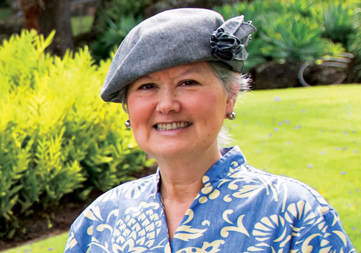
```

```{r, echo= FALSE, out.width='33%', fig.align='center',fig.cap='Donald McCaughran, UW'}

```
```{r, echo= FALSE, out.width='33%', fig.align='right',fig.cap='Brian Rothschild, UW, UMd, UMass Dartmouth'}

```

```{r, echo= FALSE, out.width='33%', fig.align='left',fig.cap='Pete Jumars, UW, UMaine'}

```


- Professional Experience

  - Instructor, Benthic Ecology, UW School of Oceanography 1982
  - Independent Scientist Woods Hole Marine Biological Laboratory 1983-1985
  - Co-instructor MBL Marine Ecology Course 1984-1987
  - UMass Boston 1983-Present

- UMass Boston Statistics courses taught, starting in 2001

  - EnvSci261: Intro. Env. Statistics (with R)
  - EnvSci601: Intro. Prob Models & Statistics (with Matlab, now R)
  - EnvSci611: Applied Statistics (R, Matlab, SPSS)
  - EnvSci612: Multivariate Statistics (Matlab)

- Professional Development in Statistics
  - Member, Boston Chapter of the American Statistical Association
  - West's Analysis of Time Series with Matlab ASA short course (2013)
  - Bates's Mixed modeling with Julia ASA short course (2017)
  - Harrell's Regression Modeling Strategies (11-14 May 2021, 4-d course)
  - Andrews' Mixed Effect Modeling (June 2022, 2-d course)
  
```{r, echo= FALSE, out.width='33%', fig.align='left',fig.cap='Michael West, Duke'}

```
```{r, echo= FALSE, out.width='33%', fig.align='center',fig.cap='Douglas Bates, University of Wisconsin-Madison'}

```
```{r, echo= FALSE, out.width='33%', fig.align='right',fig.cap='Frank Harrell, Vanderbilt'}

```
```{r, echo= FALSE, out.width='33%', fig.align='left',fig.cap='Mark Andrews, Nottingham Trent'}
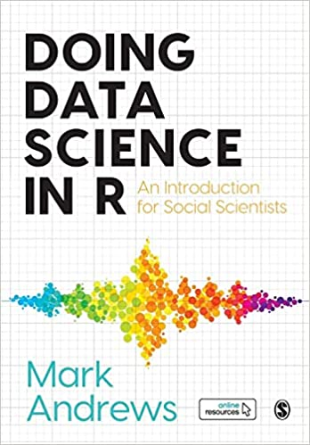
```

# Syllabus for Fall 2022 EnvSci601
      
# Introduction to R Coding: Basic R commands (from Gelman 2021, Appendix A)

```{r}
1/3
sqrt(2)
pi
curve(x^2 +5, from = -2, to=2)
a<-3
print(a)
b<-10
a+b
a*b
exp(a)
10^a
log(b)
a^b
round(3.435, 0)
round(3.435, 1)
round(3.435, 2)
x<-c(4,10,-1,2.4)
print(x)
seq(4,54,10)
c(1,3,5)
1:5
c(1:5,1, 3, 5)
c(1:5,10:20)
seq(-1,9,2)
# Sampling and random numbers
runif(1,0,100)
runif(50,0,100)
# Pick one of three colors with equal probability
color<-c("blue","red","green")
sample(color,1)
# Sample with unequal probabilities
p<-c(0.5,0.3,0.2)
sample(color,1, prob=p)
# Or do it all in one line, which is more compact but less readable:
sample(c("blue","red","green"),1,prob=c(0.5,0.3,0.2))

1/0
-1/0
exp(1000)
exp(-1000)
1/Inf
Inf + Inf
-Inf - Inf
0/0
Inf - Inf 

2+3 == 4
2 + 3 == 5
1 < 2
2 < 1
number <- runif(1, 0, 100)
color <- ifelse(number<30,"red","blue")

# Looping
for (i in 1:10){
  print("hello")}

for (i in 1:10){
  print(i)}

for (i in 1:10){
  print(paste("hello",i))}

  for (i in 1:10){
    number <- runif(1,0, 100)
    color <- ifelse(number<30, "red","blue")
    print(color)
  }

```

  ## Working with Vectors

```{r}
x <- 1:5
y <- c(3,4,1,1)
z <- c("A", "B","C")
# A vector of 5 uniformly distributed random numbers between 0 and 100:
u <- runif (5, 0, 100)
# Component wise operation on vectors
x
y
x + y
x/3
x^4

sum(x)
mean(x)

# Subscripting
a <- c("A","B","C","D","E","F","G","H","I","J")
a[1]
a[2]
a[4:6]
a[c(1,3,5)]
a[c(8,1:3,2)]
  a[c(FALSE, FALSE, FALSE, TRUE, TRUE, TRUE, FALSE, FALSE, FALSE, FALSE)]

```

# Globe Tossing: What percentage of the Earth's surface is water?

```{r, echo= FALSE, out.width='50%', fig.align='left',fig.cap='What percentage of the Earth surface is water'}
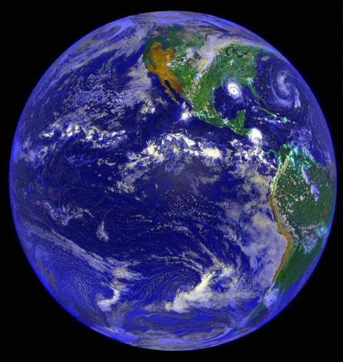
```
```{r, echo= FALSE, out.width='50%', fig.align='right',fig.cap='Gelman & Nolan Bag of Tricks'}
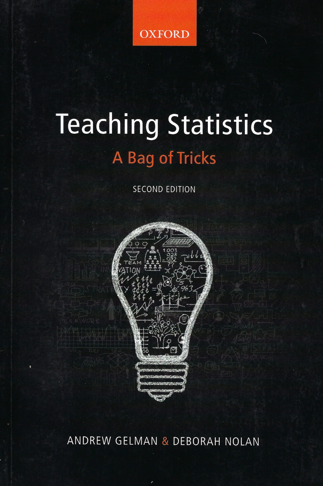
```

##  R code for Gelman & Nolan and McElreath & Kurz's globe-tossing example

Toss a globe 9 times and record on Globe_Toss.csv, W or L each time. Then read the csv file as a tidyverse tibble.

```{r}
d<-read_csv("../data/Globe_Toss.csv", col_names=TRUE, show_col_types = FALSE)  # csv delimited text file
glimpse(d)
view(d)

(
  d <-
    d %>% 
    mutate(n_trials  = 1:nrow(d),
           n_success = cumsum(toss == "W"),
           p_success = n_success/n_trials)
)
glimpse(d)
# Calculate the binomial proportions and probability
# that the globe tossing differs from the known proportion of 0.71
n<-nrow(d)
p_val<-prop.test(d$n_success[n],d$n_trials[n],0.71)  # This is base R's binomial test
p_val

# What is the frequentist interpretation of confidence interval?

# There is some controversy about the appropriate 95% CI 
# for one-sample binomial tests in frequentist statistcs (see Agresti & Coull)
# The Agresti-Coull interval one of many intervals produced by the binom pacakge
cis_all<-binom.confint(d$n_success[n],d$n_trials[n], conf.level = 0.95)
cis_all
```

## Have the computer generate globe tosses: generate 36 random coordinates for Google maps

```{r}
# Generate random coordinates to to determine Water or land in 100 trials
# Random global coordinates using geosphere
# from https://rdrr.io/cran/geosphere/src/R/randomCoordinates.R

# What are the problems in generating random lat & long coordinates on a spherical Earth?
# help(randomCoordinates)
# ??regularCoordinates # calls the help file
d1 <- randomCoordinates(36)
d2<-d1[,c(2,1)]  # swap latitudes and longitudes
d2
# Also see: https://www.random.org/geographic-coordinates/
```

## Calculate needed sample size, generate random coordinates, and check 'margins of error' (half 95% CI)

## Calculate the percentage of the Earth that is water with half 95% CI's (margins of error) of 1%.

```{r}
# Using Gallagher's LMtheorem050302_4th.m, a Matlab file, n = 7910 or n = 9604 (worst case)
# How many samples needed for a binomial margin of error, me = 0.01
alpha <- 0.05
Psn <- 1-alpha/2  # cumulative probability function for alpha = 0.05
p <- 0.71 # expected probability
me <- 0.01 # margin of error
# see Equation 5.3.4., p 304, Larsen & Marx Intro. Math. Stat. 6th ed
GlobeTosses <- qnorm(Psn)^2*p*(1-p)/me^2
GlobeTosses
# GlobeTosses <- 7910
d1<-randomCoordinates(GlobeTosses)
d2<-d1[,c(2,1)]  # swap latitudes and longitudes

# Use the sf gis package to find out whether the points are on Land or Water:
# stack exchange
# https://gis.stackexchange.com/questions/75033/given-lat-and-lon-identify-if-point-over-land-or-ocean-using-r

# view the coordinates in an interactive map
## Create an sf POINTS object
Lat <- d2[,1]
Lon <- d2[,2]
points <-tibble(Lon,Lat)
pts <- st_as_sf(points, coords=1:2, crs=4326)

## Find which points fall over land
ii <- !is.na(as.numeric(st_intersects(pts, world)))

## Check that it worked
plot(st_geometry(world))

plot(pts, col=1+ii, pch=16, add=TRUE)

n_land <- sum(ii)
n_water <- GlobeTosses-n_land
cis_all<-binom.confint(n_water,GlobeTosses, conf.level = 0.95)
cis_all

# These confidence intervals have a margin of error of 0.01, as required
```

## Calculate the worst-case sample size for a 1% margin of error, if the Earth were just 50% water.

```{r}
# Now with the conservative estimate of the effective sample size, 9604, which
# assumes that p0= 0.5

p <- 0.5 # expected probability, most conservative, largest variance
# see Equation 5.3.4., p 304, Larsen & Marx Intro. Math. Stat. 6th ed
GlobeTosses <- qnorm(Psn)^2*p*(1-p)/me^2
GlobeTosses
# GlobeTosses <- 9604
d1<-randomCoordinates(GlobeTosses)
d2<-d1[,c(2,1)]  # swap latitudes and longitudes
# stack exchange
# https://gis.stackexchange.com/questions/75033/given-lat-and-lon-identify-if-point-over-land-or-ocean-using-r
# view the coordinates in an interactive map
library(sf)
library(spData) ## For `world`, an sf MULTIPOLYGON object

## Create an sf POINTS object
Lat <- d2[,1]
Lon <- d2[,2]
# points <- expand.grid(Lon, Lat)  # Note that I reversed OP's ordering of lat/long
points <-tibble(Lon,Lat)
pts <- st_as_sf(points, coords=1:2, crs=4326)

## Find which points fall over land
ii <- !is.na(as.numeric(st_intersects(pts, world)))

## Check that it worked
plot(st_geometry(world))
plot(pts, col=1+ii, pch=16, add=TRUE)

n_land <- sum(ii)
n_water <- GlobeTosses-n_land
cis_all<-binom.confint(n_water,GlobeTosses, conf.level = 0.95)
cis_all
# These margins of error are 0.009, not 0.01, sample size n too large
```

## What does R power analysis indicate for an appropriate sample size for a 1% margin of error (1/2 95% CI)?

```{r}
# https://www.rdocumentation.org/packages/EnvStats/versions/2.3.1/topics/propTestN
library(EnvStats)
pow<-propTestN(p.or.p1 =0.72, p0.or.p2 = 0.71, alpha = 0.05, power = 0.95, 
    sample.type = "one.sample", alternative = "two.sided", 
    approx = FALSE, 
    round.up = TRUE, warn = TRUE, return.exact.list = TRUE, 
    n.min = 1000, n.max = 50000, 
    tol = 1e-8, maxiter = 10000)
GlobeTosses <- pow$n
GlobeTosses  #26504
d1<-randomCoordinates(GlobeTosses)
d2<-d1[,c(2,1)]  # swap latitudes and longitudes
# stack exchange
# https://gis.stackexchange.com/questions/75033/given-lat-and-lon-identify-if-point-over-land-or-ocean-using-r
# view the coordinates in an interactive map
library(sf)
library(spData) ## For `world`, an sf MULTIPOLYGON object

## Create an sf POINTS object
Lat <- d2[,1]
Lon <- d2[,2]
# points <- expand.grid(Lon, Lat)  # Note that I reversed ordering of lat/long
points <-tibble(Lon,Lat)
pts <- st_as_sf(points, coords=1:2, crs=4326)

## Find which points fall over land
ii <- !is.na(as.numeric(st_intersects(pts, world)))

## Check that it worked
plot(st_geometry(world))
plot(pts, col=1+ii, pch=16, add=TRUE)

n_land <- sum(ii)
n_water <- GlobeTosses-n_land
cis_all<-binom.confint(n_water,GlobeTosses, conf.level = 0.95)
cis_all

# the EnvStats package predicts way TOO many samples to produce 0.01 margins of error.
# As shown previously, the correct sample size is 7910, NOT 9604 and certainly not 26504
```

## Bayesian 95% credibility levels for globe tossing from McElreath & Kurz

```{r, echo= FALSE, out.width='100%', fig.align='center',fig.cap='Bayes Theorem'}
knitr::include_graphics('../images/BayesTheorem.jpg')
```
```{r, echo= FALSE, out.width='100%', fig.align='center',fig.cap='Bayes Theorem from Andrews (2021)'}
knitr::include_graphics('../images/Bayes_Theorem_Andrews.jpg')
```

```{r}
# code based on Simon Kurz's coding of McElreath's 'Statistical Rethinking'
# https://bookdown.org/ajkurz/Statistical_Rethinking_recoded/. Section 2.2

# Now plot the Bayesian prior and posterior distributions. This is tricky!
sequence_length <- 50

(
  d <-
    d %>% 
    mutate(n_trials  = 1:nrow(d),
           n_success = cumsum(toss == "W"),
           p_success = n_success/n_trials)
)
glimpse(d)

d %>% 
  expand(nesting(n_trials, toss, n_success), 
         p_water = seq(from = 0, to = 1, length.out = sequence_length)) %>% 
  group_by(p_water) %>% 
  # you can learn more about lagging here: 
  # https://www.rdocumentation.org/packages/stats/versions/3.5.1/topics/lag '
  # or here: https://dplyr.tidyverse.org/reference/lead-lag.html
  mutate(lagged_n_trials  = lag(n_trials,  k = 1),
         lagged_n_success = lag(n_success, k = 1)) %>% 
  ungroup() %>% 
  mutate(prior      = ifelse(n_trials == 1, .5,
                             dbinom(x    = lagged_n_success, 
                                    size = lagged_n_trials, 
                                    prob = p_water)),
         likelihood = dbinom(x    = n_success, 
                             size = n_trials, 
                             prob = p_water),
         strip      = str_c("n = ", n_trials)
  ) %>% 
  # the next three lines allow us to normalize the prior and the likelihood, 
  # putting them both in a probability metric 
  group_by(n_trials) %>% 
  mutate(prior      = prior      / sum(prior),
         likelihood = likelihood / sum(likelihood)) %>%   
  
  # plot!
  ggplot(aes(x = p_water)) +
  geom_line(aes(y = prior), linetype = 2) +
  geom_line(aes(y = likelihood)) +
  scale_x_continuous("proportion water", breaks = c(0, .5, 1)) +
  scale_y_continuous("plausibility", breaks = NULL) +
  theme(panel.grid = element_blank()) +
  facet_wrap(~strip, scales = "free_y")
```

## # Now analyze a 50-toss dataset

```{r}
sequence_length <- 50
d <- read_csv(file = "../data/Globe_Toss_50.csv") #load 50-toss data
glimpse(d)

(
  d <-
    d %>% 
    mutate(n_trials  = 1:nrow(d),
           n_success = cumsum(toss == "W"),
           p_success = n_success/n_trials)
)
glimpse(d)

d %>% 
  expand(nesting(n_trials, toss, n_success), 
         p_water = seq(from = 0, to = 1, length.out = sequence_length)) %>% 
  group_by(p_water) %>% 
  # you can learn more about lagging here: 
  # https://www.rdocumentation.org/packages/stats/versions/3.5.1/topics/lag '
  # or here: https://dplyr.tidyverse.org/reference/lead-lag.html
  mutate(lagged_n_trials  = lag(n_trials,  k = 1),
         lagged_n_success = lag(n_success, k = 1)) %>% 
  ungroup() %>% 
  mutate(prior      = ifelse(n_trials == 1, .5,
                             dbinom(x    = lagged_n_success, 
                                    size = lagged_n_trials, 
                                    prob = p_water)),
         likelihood = dbinom(x    = n_success, 
                             size = n_trials, 
                             prob = p_water),
         strip      = str_c("n = ", n_trials)
  ) %>% 
  # the next three lines allow us to normalize the prior and the likelihood, 
  # putting them both in a probability metric 
  group_by(n_trials) %>% 
  mutate(prior      = prior      / sum(prior),
         likelihood = likelihood / sum(likelihood)) %>%   
  
  # plot!
  ggplot(aes(x = p_water)) +
  geom_line(aes(y = prior), linetype = 2) +
  geom_line(aes(y = likelihood)) +
  scale_x_continuous("proportion water", breaks = c(0, .5, 1)) +
  scale_y_continuous("plausibility", breaks = NULL) +
  theme(panel.grid = element_blank()) +
  facet_wrap(~strip, scales = "free_y")

# Don't know how to get the graphs in sequence (yet) or how to pick off the
# lower and upper 2.5% credibility interval cuts
```

# Analyze the Palmer Penguin Data, a demonstration of the tidyverse: data wrangling, R graphics & statistics 

## Load the data

```{r, echo= FALSE, out.width='100%', fig.align='left',fig.cap='Penguins'}
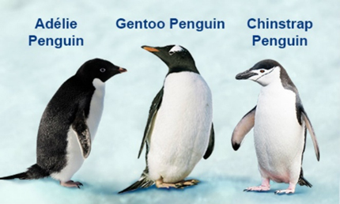
```

```{r}
# ?read_csv #let's see how we can load our csv file into an R dataframe

penguins <- read_csv(file = "../data/penguins(1).csv") #load penguins data

penguins #see data, note NA values in red, means there is no data for those points

# View the penguins dataframe
View(penguins) 
# Close the view window when done by clicking x on the top of the view

# Two other ways of analyzing the structure of the penguins dataframe:
glimpse(penguins)

str(penguins)

class(penguins)

# Use a tidyverse pipe %>% to count the number of individuals of each species.
penguins %>% #get count of each species
  count(species)

penguins %>% #Use a pipe to get mean of bill length, but 2 species have NAs. Let's fix that
  group_by(species) %>% 
  summarise(mean.bill.length = mean(bill_length_mm)) #getting mean of bill length for each species

# Create a new dataframe penguins2 that gets rid of NA ('Not Available') cases
penguins2 <- penguins %>% #make a new dataframe that gets rid of NA values
  drop_na()

View(penguins2) #great! no NAs, but 11 fewer cases 333 vs. 344
str(penguins2)
```

## Analyze descriptive statistics for Palmer Penguins

```{r}
penguins2 %>% #re-calculate the means with a tidyverse pipe
  group_by(species) %>%
  summarise(mean.bill.length = mean(bill_length_mm))

# Make a scatterplot of bill depth (x axis) vs bill length (y axis) and color 
# the points by species 
ggplot(data=penguins2, aes(x = bill_depth_mm, y = bill_length_mm, color = species)) +
  #brings in the data, tells ggplot which columns, colors by species
  geom_point() + #tells ggplot to plot it with points
  stat_smooth(method=lm, formula=y~x)  + #adds a least squares regression line for each species and sex
  theme_classic() + 
  labs(title="Palmer Penguins: Bill Depth vs. Bill Length", 
  x= "Bill Depth (mm)", y = "Bill Length (mm)") #sets the title, x and y axis labels

# Make a scatterplot of bill depth (x axis) vs bill length (y axis) and color 
# the points by species & plot sex with different symbols
ggplot(data=penguins2, aes(x = bill_depth_mm, y = bill_length_mm, color = species, shape=sex)) + #brings in the data, tells ggplot which columns, colors by species
  geom_point() + #tells ggplot to plot it with points
  stat_smooth(method=lm, formula=y~x)  + #adds a least squares regression line for each species and sex
  theme_classic() + labs(title="Palmer Penguins: Bill Depth vs. Bill Length", 
  x= "Bill Depth (mm)", y = "Bill Length (mm)") #sets the title, x and y axis labels
```

## Make coplots with different graphs for species

```{r}
# Let's make a coplot with different graphs for each species, but the same x, y scales
# The theme is also changed back to the ggplot default, a gray scale
ggplot(data=penguins2, aes(x = bill_depth_mm, y = bill_length_mm, color = species)) +
  #brings in the data, tells ggplot which columns, colors by species
  geom_point() + #tells ggplot to plot it with points
  stat_smooth(method=lm, formula=y~x)  + 
  #adds a least squares regression line for each species and sex
  facet_wrap(~species) +
  labs(title="Palmer Penguins: Bill Depth vs. Bill Length", 
       x= "Bill Depth (mm)", y = "Bill Length (mm)") #sets the title, x and y axis labels
```

## Examine sex differences

```{r}
# Let's make a coplot with different graphs for each species, but the same x, y scales, add sex
# The theme is also changed back to the ggplot default, a gray scale
ggplot(data=penguins2, aes(x = bill_depth_mm, y = bill_length_mm, color = species, shape=sex)) + #brings in the data, tells ggplot which columns, colors by species
  geom_point() + #tells ggplot to plot it with points
  stat_smooth(method=lm, formula=y~x)  + 
  #adds a least squares regression line for each species and sex
  facet_wrap(~species) +
   labs(title="Palmer Penguins: Bill Depth vs. Bill Length", 
    x= "Bill Depth (mm)", y = "Bill Length (mm)") #sets the title, x and y axis labels
```

## Analyze bill depth and length in Gentoos

```{r}
# Fit a least squares regression of bill depth and bill length in Gentoos
# but first let's make a dataframe for each of the three species
adelie <- filter(penguins2, species == "Adelie") #make a dataframe for just 
# adelie, only takes rows that have Adelie in the species column
adelie
chinstrap <- filter(penguins2, species == "Chinstrap")
gentoo <- filter(penguins2, species == "Gentoo")

# Make a scatterplot of Bill Depth (mm) [x] vs. Bill Length (mm) [y] for gentoo penguins
ggplot(data=gentoo, aes(y = bill_length_mm, x = bill_depth_mm)) + # brings in the data, tells ggplot which columns, colors by species
  geom_point() + # tells ggplot to plot it with points
  stat_smooth(method=lm, formula=y~x)  + #adds a least squares regression line
  theme_classic() + labs(title="Gentoo penguins: Bill Depth vs. Bill Length", x= "Bill Depth (mm)", y = "Bill Length (mm)")
# labs sets the title, x and y axis labels
```

## Least-squares regression of bill length vs. depth for Gentoos

```{r}
# now we will do least squares regression, lm stands for 'linear model' of 
# bill_length vs. bill depth for Gentoo penguins.

# ?lm #check the arguments for lm() to see what we need to add to the function
# the tilde symbol '~' means 'is a function of'
g.lm <- lm(bill_length_mm ~ bill_depth_mm, data = gentoo) 
# the formula is y ~ x, so the y variable has to go first!
g.lm
attributes(g.lm) #this let's you see what is in the g.lm object
g.lm$coefficients #get intercept and slope values

# get the p value for the regression (Ho: the slope is 0) from the final column of an ANOVA table
anova(g.lm)


# After invoking this command, move the cursor to the Hit <return> in console
# and hit return 4 times to see the residual plots for this regression.
```

## Boxplots of bill length for each species

```{r}
# Make a box plot of bill_length_mm for each species
ggplot(penguins2, aes(species, bill_length_mm, color = species)) +
  geom_boxplot() + #tells ggplot to make a box plot 
  theme_classic() + labs(title="Palmer Penguins: Species vs. Bill Length",
  x="Species",y="Bill Length (mm)")
```

## t tests to compare bill lengths in Adelie vs. Gentoo penguins

```{r}
# ?t.test #see the arguments for a t.test

# test whether we can reject the null hypothesis that
# adelie bill length = gentoo bill length; note the use of the $ sign to
# indicate which variable is being tested from the two different data frames
t.test(adelie$bill_length_mm, gentoo$bill_length_mm, alternative = "less") 
# Try doing the t test again, but change "less" to "greater" what happens?
t.test(adelie$bill_length_mm, gentoo$bill_length_mm, alternative = "greater")
# Now do the t test again, but change to a two-tailed or two sided alternative
# hypothesis
t.test(adelie$bill_length_mm, gentoo$bill_length_mm, alternative = "two.sided")
```

## Boxplots of sexual dimorphism in mass among species:

```{r}
ggplot(penguins2,aes(x=species,y=body_mass_g,fill=sex)) +
  geom_boxplot()+labs(title="Palmer Penguins", x = "Species",  
  y="Body Mass (g)")
```

## Plot all variables against each other

```{r}
# Install the Ggally package which has the function ggpairs and plot all
# variables pairwise
library(GGally)
# plot should include only variables: species, bill_length_mm, bill_depth_mm,
# flipper_length_mm, body_mass_g, sex
# The indices for these columns will be used to create an index vector c
# c stands for concatenate or combine
# this vector c will contain 1,3,4,5,6,7
c <- c(1,3:7)

ggpairs(penguins2,columns=c, ggplot2::aes(colour=factor(species)),
        title='Palmer Penguins')
```

# Sleuth Chapter 1 Drawing Statistical Conclusions

## Case 1: Motivation & Creativity
 
### A randomized experiment by Amabile et al. 1985 (JPSP)
		
### Questions

* Do grading systems promote creativity in students?
  
* Do ranking systems and incentive awards programs increase productivity among students?
		  
* Do rewards and praise stimulate students to learn?
		  
* Reproducibility & Replicability

```{r, echo= FALSE, out.width='100%', fig.align='left',fig.cap='Science 2015'}
knitr::include_graphics('../images/replicability_science.jpg')
```
```{r, echo= FALSE, out.width='100%', fig.align='left',fig.cap='Science 2015'}
knitr::include_graphics('../images/replicability_science_graph_table.jpg')
```

## Motivation Experimental Design

Subjects with considerable experience in creative writing were randomly assigned to two groups
    
* Intrinsic
  
* Extrinsic

The groups were asked to complete a questionnaire, ranking reasons for writing. There were two types of questionaire (see Figure): one emphasizing intrinsic rewards. The other questionaire emphasized extrinsic factors
      
```{r, echo= FALSE, out.width='100%', fig.align='left',fig.cap='Questionaire'}
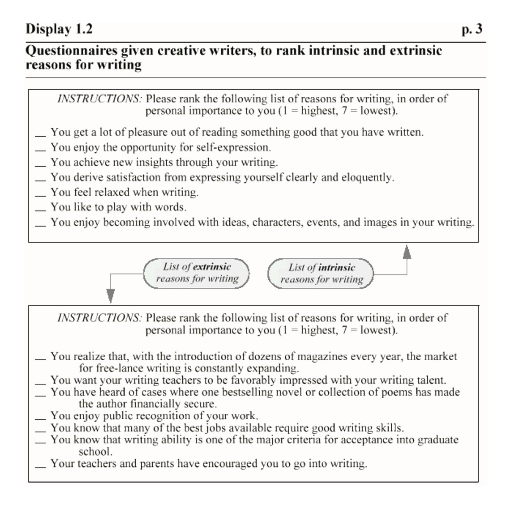
```      

All subjects asked to write a Haiku poem about laughter. All Haikus submitted to a panel of 12 poets, to be graded on a 0 to 40 point scale.
     
# Analysis of Sleuth Case Study 1.1 data with R

```{r, echo= FALSE, out.width='100%', fig.align='left',fig.cap='Questionaire'}
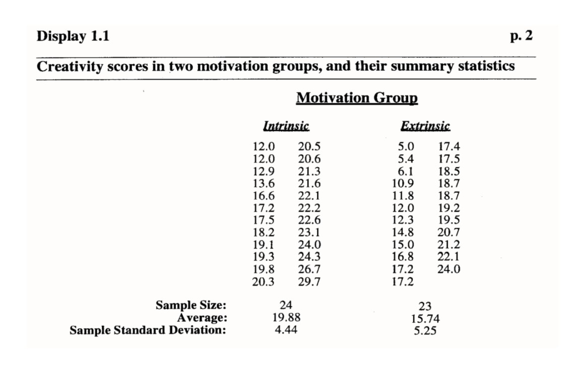
```      

## Too few significant figures can cause a fever to be missed

From Paulos: “A mathematician reads the newspaper”

Trick question for the day: What is “normal” human temperature?

Answer: 98.2º F

Wunderlich took thousands of measurements, and found that the “normal” temperature had an average of 36.8 degrees with a large standard error. With appropriate rounding to just 2 significant digits, Wunderlich reported the average human temperature as 37º C

98.6º F is the conversion from 37ºF, which should have been rounded up to 99º to maintain 2 significant figures, but this would have made the error worse. If he’d used 3 significant figures, normal temperature would be 98.2ºF

http://en.wikipedia.org/wiki/Carl_Reinhold_August_Wunderlich

If data are to be converted to different scales, incorporate 1 additional significant figure in reporting the average.

# Significant figures or digits

## From Bevington & Robinson (1992, p. 4) & Taylor (1997)

* The leftmost nonzero digit is the most significant digit

* If there is no decimal point, the rightmost non-zero digit is the least significant digit

* If there is a decimal point, the rightmost digit is the least significant digit, even if it is zero

* All digits between the least and most significant digits are counted as significant digits

* How many digits should be reported?

* These numbers all have 4 significant digits (or figures):
  + 1234
  + 123400
  + 123.4
  + 1001
  + 1000.
  + 10.10
  + 0.0001010
  + 100.0

* Best to write in scientific notation with the appropriate number of digits 1.010 x 10-4.

* Bevington & Robinson (1992): In calculations, carry only 1 digit more than the number of significant figures, round. That statement is wrong. Carry all significant figures in calculations. This is done automatically in all computer programs (to about 14 significant figures in Intel processors)

* In summary statistics, report 1 more significant figure than is present in the data (think of Wunderlich’s 98.6º F)

* Let the uncertainty define the number of significant digits
* It is incorrect to report 9.979 ± 5.015
* Due to propagation of error, the number of significant figures can not increase in a calculation
* Our 98.6º F average human temperature would be 98.2 º F if this rule were used

```{r}
library(Sleuth3)
data(case0101)
# Analyze the structure of the data table
head(case0101) # Show the 1st 6 rows of data
str(case0101)
summary(case0101)
favstats(Score ~ Treatment, data=case0101)

# from the Sleuth3 help file, with slight modifications: data = case0101
boxplot(Score ~ Treatment,data=case0101,  # Boxplots with labels
        ylab= "Average Creativity Score From 11 Judges (on a 40-point scale)",  
        names=c("23 'Extrinsic' Group Students","24 'Intrinsic' Group Students"), 
        main= "Haiku Creativity Scores for 47 Creative Writing Students")
```

## Stem & Leaf plots

```{r, echo= FALSE, out.width='100%', fig.align='left',fig.cap='Tukey stem-and-leaf plot'}
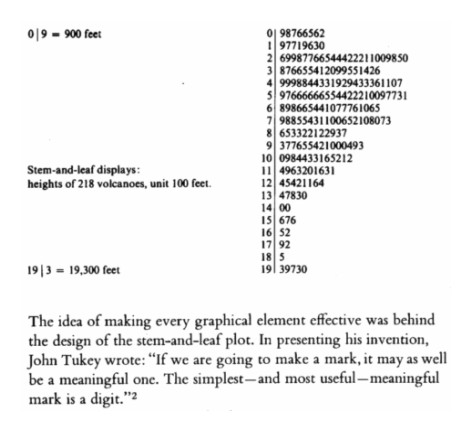
```      

```{r}
# Individual stem-and-leaf plots, from Nicholas Horton code
with(subset(case0101, Treatment == "Extrinsic"), stem(Score, scale = 5))

with(subset(case0101, Treatment == "Intrinsic"), stem(Score, scale = 5))
# This Horton code produces and error, don't know why:
# mosaic::maggregate(Score ~ Treatment, data = case0101, FUN = stem)

# Display 1.10, page 17 in the text using package aplpack, needed attach/detach
attach(case0101)
aplpack::stem.leaf.backback(Score[case0101$Treatment == "Extrinsic"],
                     Score[case0101$Treatment == "Intrinsic"],
                     back.to.back = TRUE,unit=0.1,
                     show.no.depths = TRUE)
detach(case0101)
```

```{r}
# Gallagher code with modifications by David Winsemius (1/31/12 post on R-help):
# histogram is a plotting function from the lattice package.
histogram(~Score | Treatment, data=case0101,
          scales=list(x=list(at=seq(4,32,by=4),
                             labels=sprintf("%2.0f", seq(4,32,by=4)))),
          endpoints = c(3.5, 32.5), layout = c(1,2), aspect = 1,
          xlab = "Creativity Scores")

# Equal variance t test
t.test(Score~Treatment, alternative='two.sided', conf.level=.95,
  var.equal=TRUE, data=case0101)

# Unequal variance or Welch t test
t.test(Score ~ Treatment, alternative = "two.sided", data=case0101)

# analyze with a linear model from N Horton

summary(lm(Score ~ Treatment, data = case0101))

# Monte Carlo simulations from N Horton's Chapter 1 pdf on his web site
diffmeans = diff(mean(Score ~ Treatment, data = case0101))
diffmeans # observed difference

numsim = 4999 # set to a sufficient number of Monte Carlo trials
nulldist = do(numsim) * diff(mean(Score ~ shuffle(Treatment), data = case0101))
confint(nulldist)

histogram(~Intrinsic, nint = 50, data = nulldist, v = c(-4.14, 4.14))

# Monte Carlo simulations: permutations from Robison-Cox
## Montana State University Sleuth Code (Jim Robison-Cox, Stat 410/511)
with(case0101, tapply(Score, Treatment, mean))
diff(with(case0101, tapply(Score, Treatment, mean)))
## randomly resample these numbers once, shuffling the codes:
diff(with(case0101, tapply(Score, sample(Treatment), mean)))

## how many ways can these be shuffled? 1.61238e+13
choose(47,23)      ## or choose(47, 24)
 
trials=499
random_differences <-  numeric(trials)  ## set up storage space, or mailboxes
  ## use square brackets to refer to one mailbox at a time.
for(i in 1:trials) random_differences[i] <-  diff(with(case0101, tapply(Score, sample(Treatment), mean)))

hist(random_differences,breaks=15)
# plot a vertical line at the observed difference of  4.144203
abline(v= c(4.14, -4.14),col="red")

 random_differences[which(random_differences < -4.14 | random_differences>4.14)]
  ## approximate (due to not seeing all 1.6e+13 possibilities) p-value
  ##  how extreme is the difference we observed relative to all
  ##  possible differences?
# Following Manly & Legendre & Legendre, add 1 for the observed difference to simulation

(length( which(random_differences < -4.14 | random_differences>4.14))+1)/(trials+1)

##Chihara - Hesterberg Permutation tests code (p 41)
with(case0101, tapply(Score, Treatment, mean))
observed <- diff(with(case0101, tapply(Score, Treatment, mean)))
observed

## Perform permutation analysis of means
N <- 10^3 -1 # Number of times to repeat this process
result <- numeric (N) # Space to save the random differences
# use a for loop to do (N-1=999) random permutations
for (i in 1:N)
  { # sample of size 24 from 1 to 47 without replacement
  index <- sample (47, size = 24, replace = FALSE)
  result[i] <- mean (case0101$Score [index]) - 
  mean (case0101$Score [-index])
}

hist(result,breaks = 15, xlab = "xbar1 - xbar2",
     main = "Case 1.1: Permutation distribution for creativity scores")
abline(v = c(observed, -observed), col = "blue") # add line at observed mean diff.

Pvalue <- (sum(result >= observed)+1)/(N+1) #P-value
Pvalue
```

# Statistical inference: Case Study 1.1

“There is strong evidence that a subject would receive a lower creativity score for a poem written after the extrinsic motivation questionnaire”
Two-sided p-value=0.005 from a 2-sample t test.
The effect size: 4.1 point difference on a 0-40 point scale.
95% confidence interval for the difference is 1.3 and 7.0 points

# Scope of inference: Case study 1.1

Since this was a randomized experiment, difference in creativity was caused by the difference in motivational questionnaires.
Because the individuals were not selected randomly from a larger population, extending this inference to a larger population is speculative.

# Analyze Sleuth Case Study 1.2

```{r}
data(case0102)

str(case0102)
head(case0102) # Loads the first 6 cases for viewing

# favstats from mosaic (Horton's code)
favstats(Salary ~ Sex, data = case0102)

boxplot(Salary ~ Sex, data=case0102,
        ylab= "Starting Salary (U.S. Dollars)", 
        names=c("61 Females","32 Males"),
        main= "Harris Bank Entry Level Clerical Workers, 1969-1971")

# car Boxplot, which labels the outlier
Boxplot(Salary ~ Sex, data=case0102,
        ylab= "Starting Salary (U.S. Dollars)", 
        names=c("61 Females","32 Males"),
        main= "Harris Bank Entry Level Clerical Workers, 1969-1971")

# Horton's code:
bwplot(Salary ~ Sex, data = case0102)
```

## Boxplots From Cleveland’s “Visualizing Data”

### Outside values (more than 1.5 box lengths [Interquartile range, IQR] from upper & lower hinge) also called outliers

### Extreme values (more than 3 box lengths [IQR] from upper and lower hinge): Very extreme points, extreme outliers

```{r, echo= FALSE, out.width='100%', fig.align='left',fig.cap='SPSS Application Guide Figure 2.7'}
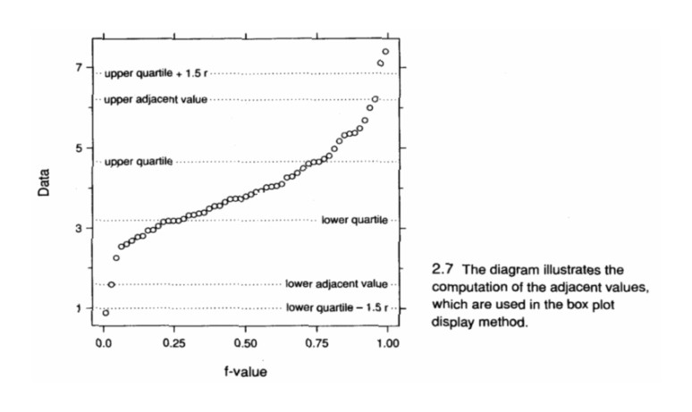
```      

## Tukey’s hinges vs. Quartiles

### Hyndman & Fan (1996) American Statistician 50: 361-365: 9 different ways to calculate quartiles

#### Tukey hinges: 702.5 & 767.5

#### SPSS quartiles: 701.25 & 773.75

#### Excel & Quattro Pro quartiles: 703.75 & 761.25

## Notched box plots

### Why 1.57 for notched boxplots? n1 = med + 1.57*(q3-q1)/sqrt(length(x));

```{r, echo= FALSE, out.width='100%', fig.align='left',fig.cap='McGill et al. 1978'}
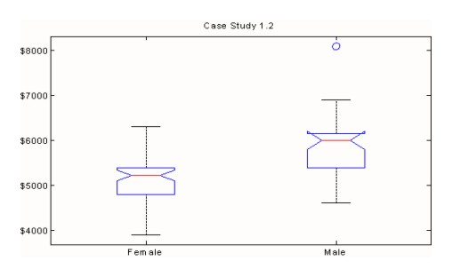
```      

```{r, echo= FALSE, out.width='100%', fig.align='left',fig.cap='Nordhaus, W. PNAS 2006 103: 3495'}
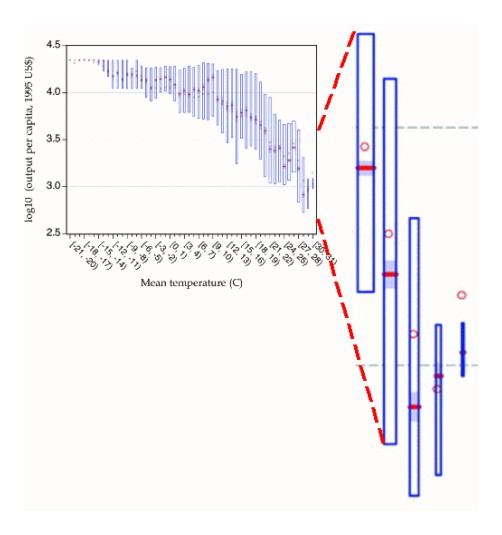
```      

## Tufte’s & Gallagher’s Rules

### Tufte’s Rule: Every part of a scientific graphic -–  the colors, the lines, and their orientation — should convey information.

### Gallagher’s Rule: You have no more than 1 minute to convey the information in a slide.  You can’t spend 30 seconds describing an unusual plotting method, like the McGill notched boxplot or the Nordhaus data-filled boxplot

### Gallagher’s rule trumps Tufte’s rule

## Miscellaneous plots of the Case 1.2 salary

```{r}
# densityplot from the lattice package
densityplot(~Salary, groups = Sex, auto.key = TRUE, data = case0102)

# Histograms
attach(case0102)
hist(Salary[Sex=="Female"]) 
hist(Salary[Sex=="Male"])
detach(case0102)

# Gallagher code with modifications by David Winsemius (1/31/12 post on R-help):
# histogram is a plotting function from the lattice package.
histogram(~ Salary | Sex, data=case0102,
               scales=list(x=list(at=seq(4000,8000,by=2000),
               labels=sprintf("$%4.0f", seq(4000,8000,by=2000)))),
                 endpoints = c(3500, 8500), layout = c(1,2), aspect = 1,
                 xlab = "Salary", main="Case 1.2")
                 
## I can't get the y labels to plot properly on this back-to-back plot, part of
# Frank Harrell's Hmisc package.

# out <- histbackback(split(case0102$Salary, case0102$Sex), probability=TRUE, xlim=c(-.001,.001),
options(digits=1)  # This used to be digits=0, but this produced an error
out <- histbackback(split(case0102$Salary, case0102$Sex), probability=FALSE, xlim=c(-30,30),
                    main = 'Sleuth Case 1.2',ylab='Starting Salaries($)')
#! just adding color
barplot(-out$left, col="red" , horiz=TRUE, space=0, add=TRUE, axes=FALSE)
barplot(out$right, col="blue", horiz=TRUE, space=0, add=TRUE, axes=FALSE)
options(digits=3)
# Plots somewhat like Display 1.13 on page 20 in 3rd edition

# Plot some distributions
histogram(rnorm(1000)) # Normal

histogram(rexp(1000)) # Long-tailed

histogram(runif(1000)) # Short-tailed

histogram(rchisq(1000, df = 15)) # Skewed
```

## Test for differences in the mean salaries for men & women in Case 1.2

Using t test and a variety of permutation tests.

```{r}
diffSex<-diff(with(case0102, tapply(Salary,Sex, mean)))
sprintf('The difference in salary was %8.4f',diffSex)

# Independent sample t test, equal variances assumed:
t.test(Salary~Sex, alternative='two.sided', conf.level=.95, var.equal=TRUE, 
  data=case0102)

# Permutation test from Horton's Sleuth code
obsdiff = diff(mean(Salary ~ Sex, data = case0102))
obsdiff

numsim = 999
res = do(numsim) * diff(mean(Salary ~ shuffle(Sex), data = case0102))
densityplot(~Male, data = res)
confint(res)

# Add the Manly-Legendre convention for simulations to add 1 for the actual
# This prevents reporting a p-value of 0, which it never is.
p = (sum(abs(res$Male) >= abs(obsdiff))+1)/(numsim +1)
p

# Robison Cox's MSU simulation

observed <- diff(with(case0102, tapply(Salary,Sex, mean)))
## 818.0225

plot(Salary ~ Sex, data = case0102) # because code is numeric, gender is a factor

with(case0102, tapply(Salary,Sex, length))

# How many combinations with groups of size 61 & 32
choose(61+32,32)
trials = 10^4 -1
random_differences <-  numeric(trials)  ## set up storage space, or mailboxes
## use square brackets to refer to one mailbox at a time.
for(i in 1:trials) random_differences[i] <-  diff(with(case0102, tapply(sample(Salary),Sex, mean)))
hist(random_differences, breaks=15)
abline(v= c(-1,1) * observed, col="red")
l<-length( which(random_differences < -observed | random_differences> observed))/1000
## approximate p-value < 1 in 1000
Pvalue <- (l+1)/(trials+1)
Pvalue

##Chihara - Hesterberg Permutation tests code (p 41)
with(case0101, tapply(Score, Treatment, mean))
observed <- diff(with(case0102, tapply(Salary, Sex, mean)))
observed

## Perform permutation analysis of means
N <- 10^4 -1 # Number of times to repeat this process
result <- numeric (N) # Space to save the random differences
for (i in 1:N)
{ # sample of size 32 from 1 to 32 without replacement
  index <- sample (61+32, size = 32, replace = FALSE)
  result[i] <- mean (case0102$Salary [index]) - 
    mean (case0102$Salary [-index])
}

# scale is off, need to fix sometime
hist(result,breaks = 15, xlab = "xbar1 - xbar2",
     main = "Case 1.2: Permutation distribution for salaried")
abline(v = c(observed, -observed), col = "blue") # add line at observed mean diff.

Pvalue <- (sum(result >= observed)+1)/(N+1) #P-value
Pvalue

```

```{r, echo= FALSE, out.width='100%', fig.align='left',fig.cap='Sleuth Display 1.5'}
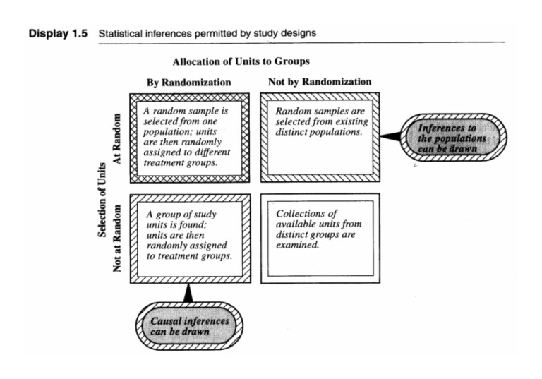
```      

# Statistical inferences and chance mechanisms

An inference is a conclusion that patterns in the data are present in some broader context

A statistical inference is an inference justified by a probability model linking the data to the broader context

# Randomization

From Kendall & Stuart’s (1977) ‘Advanced Theory of Statistics’
“The principle of randomization is simply stated: Whenever experimental units are allocated to factor-combinations in an experiment, this should be done by a random process using equal probabilities.”

“Even if the relationship of the dependent variable with some unsuspected causal factor is not recognized until after the experiment, the validity of the inferences will not be impaired, provided that the factor's influence was “randomized out” of the experiment.”

Kendall & Stuart (1977) on experiments
In any experiment the factors influencing the dependent variable are, explicitly or implicitly, divided by the experimenter into three classes:
- Those incorporated into the structure of the experiment
- Those “randomized out” of the experiment
- Those neither incorporated nor randomized out

Classes 1 & 2 require positive action, affecting the layout of the experiment, or the randomization procedure employed. A factor may find its way into class (3) by simply being overlooked.

What makes a good experimenter? Kendall & Stuart (1977)
“A substantial part of the skill of the experimenter lies in his choice of factors to be randomized out of the experiment.  If he is careful, he will randomize out all the factors which are suspected of being causally important but which are not actually part of the experimental procedure. But every experimenter necessarily neglects some conceivably causal factors; if this were not so, the randomization procedure required would be impossibly complicated.  Thus the choice of what factors to be randomized out is essentially a matter of judgement.”

Description of experimental design should include
- The nature of the experimental units to be employed
- The number and kinds of treatments and the properties of the responses that will be measured.
- Specification of how the treatments will be assigned to the available experimental units (replicates)
- The physical arrangement of the experimental units, (and often) the temporal sequence in which treatments are applied to and measurements made on the different experimental units.’

# Randomized Experiments vs Observational Studies

- Randomized experiment: a chance mechanism used to assign subject to groups
- Observational study: group status beyond the control of the investigator
- “Statistical inferences of cause-and-effect relationships can be drawn from randomized experiments, but not from observational studies”
- “A confounding variable is related both to group membership and to the outcome.  Its presence makes it hard to establish the outcome as being a direct consequence of group membership.”  (Male experience)

# Sample surveys vs. experiments from Kendall & Stuart's “The Advanced theory of statistics” (1977)

- "The distinction between the design of experiments and the design of sample surveys is fairly clear-cut, and may be expressed by saying that in surveys we make observations on a sample taken from a finite population of individuals, whereas in experiments we make observations which are in principle generated by a hypothetical infinite population, in exactly the same way that the tosses of a coin are. Of course, we may sometimes experiment on the members of a sample resulting from a survey, or even make a sample survey of the results of an (extensive) experiment, but the essential distinction between the two fields should be clear."
Inferences to populations

Sleuth is too restrictive here: Inferences to populations can be drawn from random sampling studies, but not otherwise

Simple random sampling (SRS): A simple random sample of size n from a population is a subset of the population consisting of n members selected in such a way that every subset of size n is afforded the same chance of being selected.

Random sampling ensures that all subpopulations are represented in the sample in roughly the same mix as in the overall population.

Statistical inference procedures incorporate measures of uncertainty that describe that chance.
Selecting a random sample
- Simple random sampling
- Stratified random sampling
- Multilevel sampling (e.g., Regions, Lakes, areas within lakes)
- Systematic sampling


```{r, echo= FALSE, out.width='100%', fig.align='left',fig.cap='Manly Figure 1.2'}
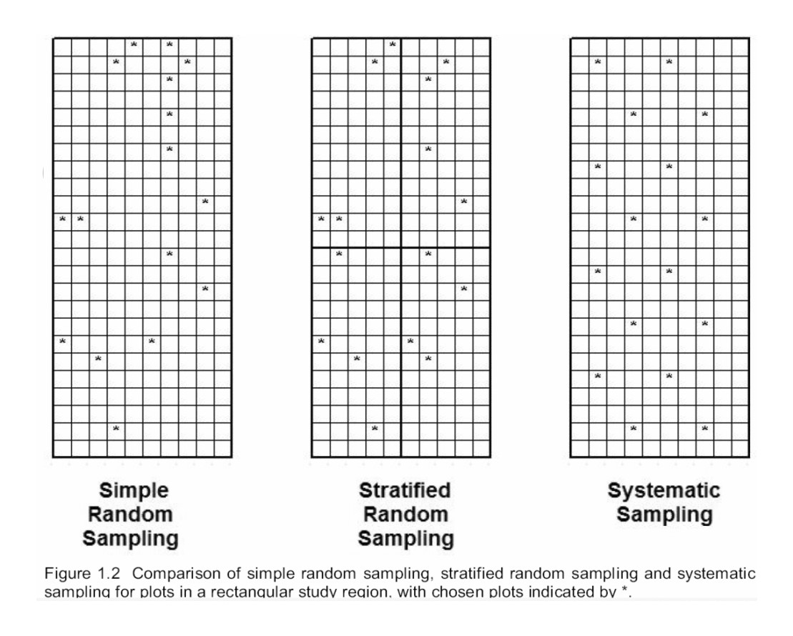
```      

- Quadrat samples
- Line transect samples: see Hayek & Buzas (1996)
- Random cluster sampling (selecting blocks or grids at random)
 - Lakes: Can adjust the probability of being sampled
  - Adaptive cluster sampling (Thompson 1990)
  
  
```{r, echo= FALSE, out.width='100%', fig.align='left',fig.cap='Thompson 1990'}
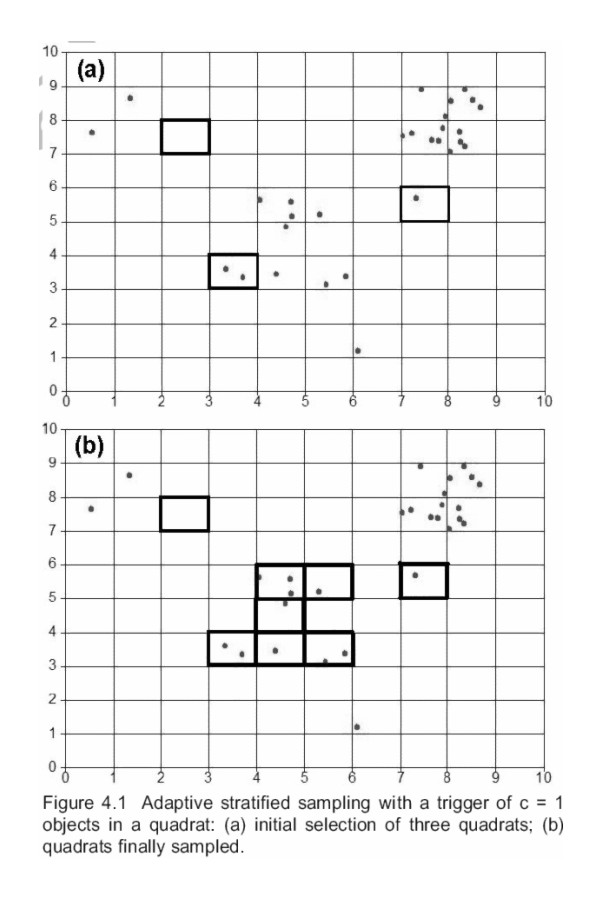
```      

	- Variable probability sampling
	- EMAP
  
```{r, echo= FALSE, out.width='100%', fig.align='left',fig.cap='EMAP Virginia Province'}
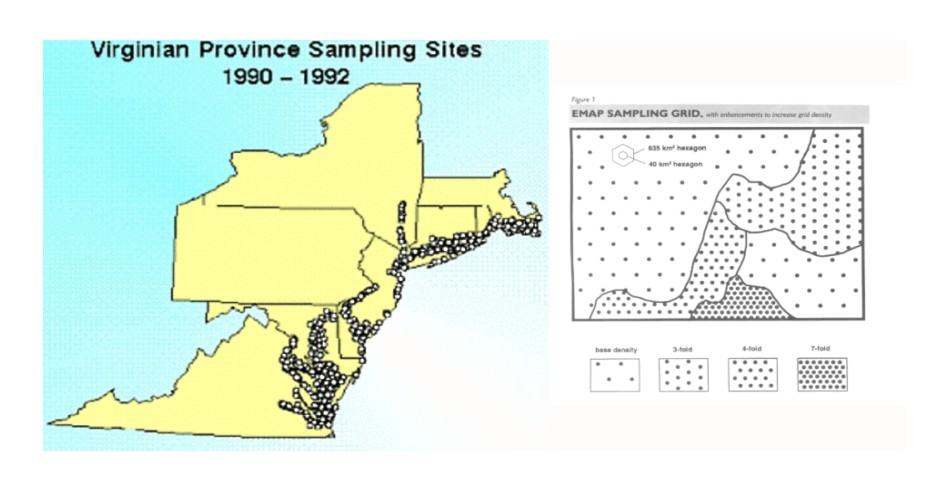
```      

- MA Bay sampling

  - Random locations, but many rocky stations deleted
   
```{r, echo= FALSE, out.width='100%', fig.align='left',fig.cap='MWRA MA Bay sampling'}
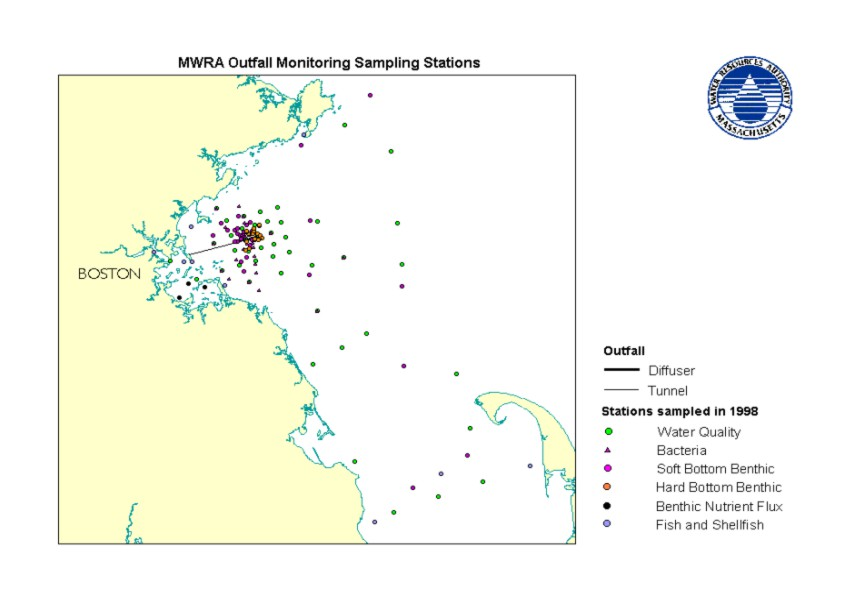
```      

  - Boston Harbor sampling
    - 8 stations sampled since 1991: not selected randomly
     
```{r, echo= FALSE, out.width='100%', fig.align='left',fig.cap='BostonHarbor sampling'}
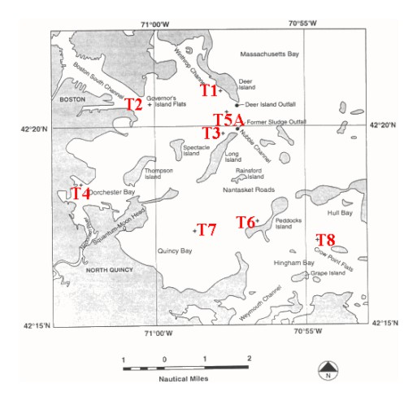
```      

# P-value
P-value
Modified from K Wuensch
The p-value is the probability of obtaining data as or more discrepant with respect to the null and alternative hypothesis than are those in the present sample, assuming that the null hypothesis is absolutely correct. In a one-sample z-test of the hypothesis μ = μ_o, a z-score of 1.96 can have p-value 0.975, 0.05 or 0.025 depending on whether the alternative hypothesis is μ < μ_o, μ ≠ μ_o, or μ > μ_o, respectively.

# Summary & Conclusions on Sleuth Ch 1

* Statistical Sleuthing
* Significant digits 
* Case Studies 1.1 & 1.2
* Histograms, density plots, stem-and-leaf & dot plots
* Randomization, Fisher’s major contribution
* Experiment vs. observational study (survey),
* Experimental design
* Sampling schemes (SRS, stratified, systematic, adaptive, EMAP probability based sampling)
* Probability model for randomized experiments
* Randomization distribution
* p values