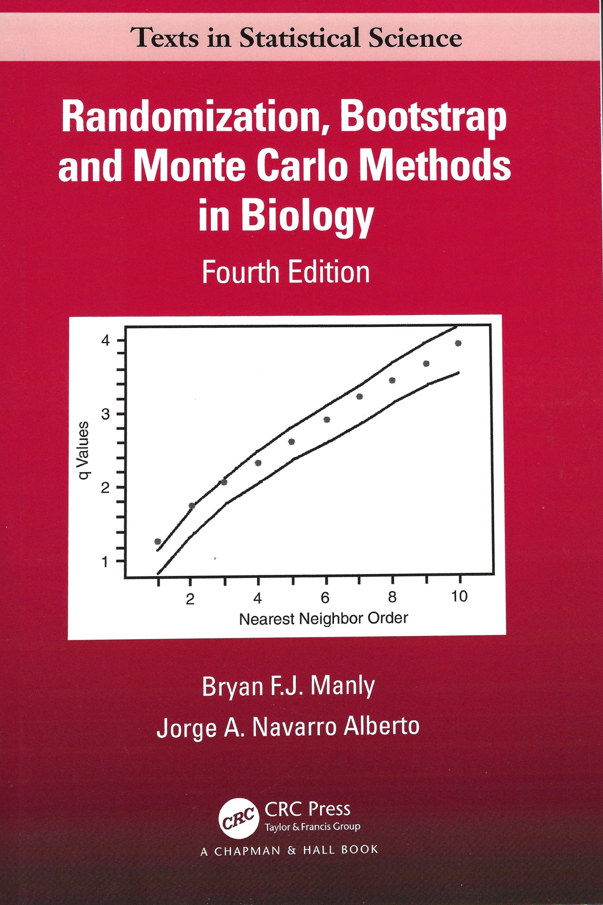

```{r setup, include=FALSE}
knitr::opts_chunk$set(echo = TRUE)
library(coin)      # for rank-based procedures
library(dplyr)     # data manipulation
library(exactRankTests)
library(ggformula) # graphics, a part of the tidyverse
library(MASS)
library(mosaic)    # Nick Horton's package
library(Sleuth3)   # Ramsey & Schafer's Statistical Sleuth 3d edition
```

# Homework Solutions (5:30 PM - 6:00 PM)

## Basic Sleuth3::ex2.22 Male and Female Intelligence

### Jamie Beshore

## Basic Sleuth3::College Tuition

### Orla O'Brien

## Supplemental Sleuth2::2.21 Bumpus's sparrows: weights of birds

### Shibo Cao

## Supplemental Sleuth2::3.31 Iron supplementation

### Keith Hankowsky

## Master Problem Random permutation of cloud seeding data

### Scott Schaffer

***

# Outline of Class 3 on Sleuth Chapter 4: Note Sleuth has omissions & mistakes

* Rank-based and permutation tests (randomization tests) are NOT a solution to the Fisher-Behrens [unequal variance] problem. Sleuth is wrong on this point. Like the parametric tests, the noparametric and permutation tests assume equal spread for groups being compared.

* Wilcoxon’s Rank Sum Test (same probability model as the later published Mann-Whitney U test): 

    + Ties corrections & exact p values not in Sleuth, but should be
    
* Repeated Measures Tests based on ranks: Wilcoxon Sign Rank & Fisher’s Sign Test

* Advantages of nonparametric over parametric procedures (from Hollander & Wolfe 1999, p 1)

  +   Nonparametric methods require few assumptions about the underlying populations. In particular, nonparametrics forego the assumption that the underlying populations are normal
  
  +   Nonparametric procedures often enable the user to obtain exact p-values and exact coverage probabilities for confidence intervals.
  
  +   Nonparametric procedures are often easier to apply [archaic given R and other programs]
  
  +   Nonparametric procedures are quite easy to understand
  
  +   Power efficiency not an issue, ties not that much of an issue
  
  +   Nonparametric procedures can be applied when only the ranks of the data are available
  
  +   The jackkniife and bootstrap allow nonparametric procedures to be applied when the parametric tests are intractable
  
  +   High speed computers and modern software facilitate the calculations of exact p values.
  
  * Disadvantages of nonparametric procedures
  
    +   Dealing with covariates & estimating effect sizes can be an issue with nonparametric statistics
    
    +   There is a huge array of parametric analyses (most in fact) with no nonparametric equivalent
  
* Unequal variance (Welch’s) t test: some theoretical and practical problems, but overall an excellent solution for unequal variances

* Supplemental material

  + Gallagher's Matlab program unequalvariances.

  + Two-sample binomial test & Fisher’s test (covered in Sleuth Ch 19)
  
  + The Fligner-Policello test, not presented in Sleuth, is a rank-based test for samples with unequal variance, but it is a very poor test

# Statistical Sleuth Case 4.1: The Challenger Disaster


## Summary of Statistical findtings from Sleuth3

There is strong evidence that the number of O-ring incidents was associated with launch temperature in these 24 launches
-   p-value = 0.0099 from a permutation test on the t statistic

<span style="color: red;">**Sleuth's permutation test of the Student's t distribution violates the key assumption of the permuation test that the spreads are equal in the two groups (Hollander & Wolfe 1999, Manly 1997, and Chihara & Hesterberg 2011). Their analysis is simply wrong.** </span>

# Statistical Sleuth Case 4.2: Cognitive Load experiment

***


***


***


***


***

# Wilcoxon's Rank-sum Test


 


***


***


***

 

## Mann-Whitney U test, published after Wilcoxon (1945)

### Mann & Whitney (1947)

* The statistic U can be computed as follows (Hollander & Wolfe 1999)

1. For the two groups X~i~ and Y~j~ with m & n cases, consider each of the m × n pairs

2. For each pair of values X~i~ and Y~j~, observe which is smaller.

3. If the X~i~ value is smaller, score a 1 for that pair.  If the Y~j~ value is smaller, score a 0 for that pair.

4. U is the sum of the scores.

5. Mann & Whitney showed that in the case of no ties:

  +   T=U+[n(n+1)/2], where T is the sum of ranks from the Wilcoxon rank sum test
  +   Thus, the Wilcoxon & MW-U tests are exactly equivalent
  
6. When, X~i~ and Y~j~ are tied, score 1/2

# Other Alterantives for two independent samples

## Permutation tests

 
 
***

[The Challenger Disaster portraying Richard Feynman's role, played by William Hurt, in the Presidential Commission] (https://www.youtube.com/watch?v=bvv2-7iOD_8)

***

 

***

# The unequal variance t test or Welch t test, the R default *t* test

 

 ***
 


***

## Problems and alternatives to Welch's t test
  
  *   Conceptual difficulties interpreting differences in central tendency if variances unequal

  *   Exact distribution of test statistic unknown
  
  *   The Satterthwaite _df_ is an approximation, Usually non-integer

  *   Welch's test isn’t necessarily conservative

  *   Doesn’t generalize easily to more than 2 groups as does Student's test
  
  *   There are alternate procedures to Welch
  
    ** Variance-stabilizing transformations
    
    ** Generalized linear models using different error structure (e.g. Poisson or negative binomial distributions)
    
## Levene’s test, Section 4.5.3: tests for equality of variance (homoscedasticity)
    
* Sleuth’s Levene’s test on page 103-104 in 3rd ed is not the same as the Levene’s test used by SPSS and R
    
  + Sleuth: squared deviations from the mean used as the variables in a t test
    
  + SPSS & R: absolute values used
    
  + SPSS:  ∣ observations-mean ∣ used in an F test
    
* Other Levene’s tests

  + ∣observations-median ∣ used in t or F test, also called the Brown-Forsythe test
      
  + R: car::leveneTest ∣observations-median ∣ used in an F test; mean deviations is an option
      
* The results of these different Levene's tests can often be quite different
    
+ Levene’s tests have largely replaced the F~max~ and Bartlett’s tests as tests for equal variance
    
* **Inspection of boxplots usually sufficient for assessing equal spread, especially for small datasets where Levene's test can have low power to detect unequal variance**.
    
    

***

    

***

## Wilcoxon rank sum test (and permutation tests) assume equal spread (Hollander & Wolfe 1999)
    
* The observations of X~1~, ..., X~m~ are a random sample from population 1, independent and identically distributed. The observations of Y~1~, ..., Y~m~ are a random sample from population 2, independent and identically distributed
    
* The X’s and Y’s are mutually independent
    
* Populations 1 and 2 are continuous [i.e., no ties]
    
* **“Robustness of level: The significance level of the rank sum test is not preserved if the two populations differ in dispersion or shape.  This is also the case for the normal theory 2-sample t test.”** Hollander & Wolfe (1999), p. 120
    

## Fligner-Policello test. 

* Wilcoxon-rank sum test for unequal variances Matlab m.file available, p<3x10-14 for O-ring data!
  
* Gallagher doesn’t recommend for small samples
  
* References

    +   Fligner, M. A. and Policello, G. E. (1981), Robust rank procedure for the Behrens-Fisher Problem. Journal of the American Statistical Association, 76(373): 162-168.
    
    +   Hollander, M. and Wolfe, D. (1999), Nonparametric Statistical Methods (2nd ed.).  New York: John Wiley & Sons, Inc. p. 135-139. 
    
 

***


## Manly & Navarro Alberto (2020, p 73)

  - In fact, a randomization test may or may not perform bettern than a t-test when variances are unequal, depending on the ratio of the sample sizes (Boik, 1987; Hayes 2000, Neuhouser and Manly 2004)
  
```{r, echo= FALSE, out.width='33%', fig.align='left',fig.cap='Manly & Navarro Alberto (2020)'}


```

## Chihara & Hesterberg (2011) on assumptions of the permutation tests
 
- First, there is no distributional assumption on the two populations, i.e., there is no normality requirement

- There is no requirement for random sampling, but for experiments it does require that subjects be assigned to groups
randomly

- "In the usual case that the two groups are samples taken from two populations, pooling the data does require that the two populations must have the same mean, spread, and shape.

- This does not mean that the two samples have the same mean, spread, and shape. There will always be some chance variation in the data"

- "In practice, the permutation test is usually robust when the two populations have different distributions. <span style="color: magenta;">The major exception is when the two populations have different spreads and the sample sizes are dissimilar.</span>" [emphasis added]

***


***

- Results of a simulation with 1000 trials, drawing uniform random numbers with identical mean (=0) but with variances of 1.0 for a group of size 4 and 0.274 for groups of size 20 {34 min simulation time}

  - X has    4 cases; Y has   20 cases

  - std(X)=1; std(Y)=0.5235

  - There were 10000 trials with 1000 random permutations within each trial.

  - Student's t: P(Type I error| alpha=5%)=   __21.4%__

  - Wilcoxon's rank sum test, approx: P(Type I error|alpha=5%)=   __13.6%__

  - Welch's unequal variance t test: P(Type I error|alpha=5%)=  __9%__

  - Random permutations of t ratios: P(Type I error|alpha=5%)=  __21.4%__

- _Statistical conclusions_ With uniformly distributed samples with the same variance and mean as the Case 4.1 Challenger data, the equal variance t test produces highly inflated Type I errors (21.4% vs the expected 5%). Permutations using the Student's t ratio produce a nearly identical inflated probability of Type I error.  The probability of Type I error was also inflated for the approximate Wilcoxon’s rank sum test (13.6%) and Welch’s t test (9%). **None of these tests is appropriate for data with distributions similar to the Case 4.1 data.**

***

I have written many thousands of Matlab programs in the last 30 years, but none can be run within RMarkdown. There is an alternative to RMarkdown called the Jupyter notebook, which has the ability to integrate text, Julia, R, Python (hence the name Jupyter). It will also allow you to integrate Matlab code: https://www.mathworks.com/help/cloudcenter/ug/run-matlab-desktop-in-jupyter.html
I've run Jupyter notebooks many times, but it is not as easy to format nice looking documents as RMarkdown and Jupyter notebooks can not be created in RStudio.

***


***


***


```{r Fisher Test}
## Fisher's exact hypergeometric test on the Case 4.1 o-ring data

## As described in Gallagher's 9/21/21 lecture, the Fisher test is the most appropriate
## test for these data.
LaunchData<-matrix(c(4, 0, 3, 17), nrow = 2,
       dimnames = list(Warm = c("Incident", "No Incident"),
                       Cold = c("Incident", "No Incident")))
LaunchData
fisher.test(LaunchData)
fisher.test(LaunchData,alternative="greater")
## Note that the 1-tailed and two-tailed p values are the same for this
## 2 x 2 contingency table. There is no extreme on the other tail as 
## extreme as 100% incidents on the launch. That also prevents odds ratios
## from being calculated.

```

```{r 2 sample binomial}
# A simpler test is the 2 sample binomial
mdat <- matrix(c(4,0, 3,17), nrow = 2, ncol = 2, byrow = TRUE,
               dimnames = list(c("Cold", "Warm"),
                               c("Incident", "No Incident")))
mdat
binom2s<-stats::prop.test(mdat,p=NULL,alternative="two.sided", conf.level =0.95, correct=F)
binom2s
# Now perform with the Yates continuity correction, which some advise
binom2sY<-stats::prop.test(mdat,p=NULL,alternative="two.sided", conf.level =0.95, correct=T)
binom2sY

```

_Result of the two-sample binomial test of the Case 4.1 o-ring data_ The proportion of failures in cold temperature was 100%, and the proportion in warm temperatures was 15%. A two-sample binomial test indicates strong evidence for a difference in these proportions (p=0.0006, chi-square =12 (1 df), but the sample sizes are small.)

***

```{r R code from RScs0401_3rd.R, echo=FALSE}
attach(case0401)
(mCool <- mean(Incidents[Launch=="Cool"])) 
(mWarm <- mean(Incidents[Launch=="Warm"]))
mDiff <- mCool - mWarm
c(mCool,mWarm,mDiff)  # Show the values of these variables
(vCool <- var(Incidents[Launch=="Cool"])) 
(vWarm <- var(Incidents[Launch=="Warm"]))
c(vCool,vWarm)
detach(case0401)
```

## PERMUTATION TEST, VIA REPEATED RANDOM RE-GROUPING (ADVANCED)

```{r R code from RScs0401_3rd.R_1, echo=TRUE}
attach(case0401)
numRep  <- 10000 # Number of random  groupings. CHANGE TO LARGER NUMBER; eg 100,000.
# but 100000 permutations is slow in R, about 40 seconds.
rDiff   <- rep(0,numRep) # Initialize this variable to contain numRep 0s.
for (rep in 1:numRep) {  # Repeat the following commands numRep times:
  randomGroup <- rep("rWarm",24)  # Set randomGroup to have 24 values "rWarm"
  randomGroup[sample(1:24,4)]  <- "rCool"  # Replace 4 at random with "rCool"
  mW  <- mean(Incidents[randomGroup=="rWarm"]) # average of random "rWarm" group
  mC  <- mean(Incidents[randomGroup=="rCool"]) # average of random "rCool" group
  rDiff[rep] <- mC-mW  # Store difference in averages in 'rep' cell of rDiff
}  # End of loop
detach(case0401)
```

### Histogram of difference in averages from 10,000 random groupings

```{r R code from RScs0401_3rd.R_2, , echo=TRUE}
hist(rDiff,  
     main="Approximate Permutation Distribution",
     xlab="Possible Values of Difference in Averages",
     ylab="Frequency of Occurrence")
abline(v=mDiff)  # Draw a vertical line at the actually observed difference
pValue <- sum(rDiff >= 1.3)/numRep  # 1-sided p-value
pValue  
text(mDiff,75000, paste(" -->",round(pValue,4)), adj=-0.1)
```

## # Horton addendum

```{r R code from RScs0401_3rd.R_3, echo=TRUE}
trellis.par.set(theme = col.mosaic()) # get a better color scheme for lattice
options(digits = 3, show.signif.stars = FALSE)

favstats(Incidents ~ Launch, data = case0401)

histogram(~Incidents | Launch, data = case0401)
t.test(Incidents ~ Launch, var.equal = TRUE, data = case0401)
# How many combinations (24 choose 4)
(C244 = factorial(24)/(factorial(4) * factorial(24 - 4)))

case0401$Incidents[c(1, 2, 4, 24)]
with(case0401, t.test(Incidents[c(1, 2, 4, 24)], Incidents[-c(1, 2, 4, 24)], var.equal = TRUE))

case0401$Incidents[c(1, 4, 5, 24)]

with(case0401, t.test(Incidents[c(1, 4, 5, 24)], Incidents[-c(1, 4, 5, 24)], var.equal = TRUE))

(C1113 = factorial(5)/(factorial(3) * factorial(5 - 3)) * 1)
(C1123 = factorial(5)/(factorial(2) * factorial(5 - 2)) * 1 * 1)
(C0123 = 17 * 5 * 1 * 1)
(C0123 = 17 * 5 * 1 * 1)

(onep = (C1113 + C1123 + C0123)/C244)

result <- t.test(Incidents ~ Launch, var.equal = TRUE, data = case0401)$statistic
result
```

### # Random permutations, 1e5 permutations about 40 secs.

```{r R code from RScs0401_3rd.R_4, echo=TRUE}
nulldist = do(10000) * t.test(Incidents ~ shuffle(Launch), var.equal = TRUE,
                                 data = case0401)$statistic
histogram(~t, groups = t >= result, v = result, data = nulldist)
tally(~t >= result, format = "proportion", data = nulldist)
```

### Jim Robison Cox's (Montana State University r scripts

```{r R code from RScs0401_3rd_5.R, echo=TRUE}
attach(case0401)
## The exactRanktests package is no longer supported by R, but it is fast
perm.test(Incidents ~ Launch,case0401, alt="greater")
# calculate the number of permutations (see text)
choose(5,2)
(choose(17,1) * choose(5,1) + choose(5,3) + choose(5,2))/ choose(24,4)

## As described in Gallagher's 9/21/21 & 9/20/22 lectures, the Fisher test is
# the most appropriate test for these data.
LaunchData<-matrix(c(4, 0, 3, 17), nrow = 2,
       dimnames = list(Warm = c("Incident", "No Incident"),
                       Cold = c("Incident", "No Incident")))
LaunchData
fisher.test(LaunchData)
fisher.test(LaunchData,alternative="greater")
## Note that the 1-tailed and two-tailed p values are the same for this
## 2 x 2 contingency table. There is no extreme on the other tail as 
## extreme as 100% incidents on the launch. That also prevents odds ratios
## from being calculated.
fisher.test(LaunchData,alternative="greater")
detach(case0401)
```


***


# Gallagher's summary of statistcal findings for the the Case 4.1 Challenger O-rings

There is strong evidence that the number of O-ring incidents was associated with launch temperature in these 24 launches. It is highly unlikely that the observed difference in proportion of incidents—100% of flights with incidents below 65º F but only 15% of flights with temperatures above 65º—could have been due to chance (Fisher’s exact hypergeometric test, 2-tailed p =0.0033).

# Asymptotic Power Efficiency of Wilcoxon's Rank Sum Test

- Asymptotic power efficiency: the ratio of sample sizes required to obtain the same p values

- For normally distributed data, the power efficiency of the Wilcoxon rank sum test is 95.5% of the Student’s t test.

- For other distributions (e.g., exponential distributions), the power efficiency can be >> 100% (300% for exponential)

- Hollander & Wolfe (1999, p. 140)

***


***


***

# Alternatives to the Paired t test: Wilcoxon's Signed Rank and Fisher's Sign tests


***

## Analysis of Case Study 2.2 Schizophrenia data


***

```{r}
# Analysis of the Case 2.2 Schizophrenia data
# Code excerpted from Adam Loy's tidySleuth3
data(case0202)
summary(case0202)
diff<-case0202[, "Unaffected"] - case0202[, "Affected"]
favstats(diff)
densityplot(diff)
```
```{r}
# Perform a paired t test on the Case 2.2 Schizophrenia data
tout<-t.test(case0202$Unaffected, case0202$Affected, paired = TRUE)
tout
str(tout)
sprintf('The difference in volumes is %4.2f cm^3 with a standard error of %4.2f',tout$estimate,tout$stderr)
```

```{r caese0202 plot}
boxplot(diff, 
        ylab="Difference in Hippocampus Volume (cubic cm)", 
        xlab="15 Sets of Twins, One Affected with Schizophrenia",
        main="Hippocampus Difference: Unaffected Minus Affected Twin",  
        col="green", boxlwd=2, medlwd=2, whisklty=1, whisklwd=2, 
        staplewex=.2, staplelwd=2, outlwd=2, outpch=21, outbg="green",
        outcex=1.5)      
abline(h=0,lty=2) 

```

***

### Statistical summary based on the parametric paired *t* test

There is substantial evidence that the mean difference in the left hippocampus volumes between schizophrenic individuals and their nonschizophrenic twins is nonzero (two-sided p-value = 0.006, from a paired *t* test). It is estimated that the mean volume is 0.20 cm^3^ smaller for those with schizophrenia (about 11% smaller). A 95% confidence interval for the
difference is from 0.07 to 0.33 cm^3^.

***


***

## R analyses using RScs0202_3rd.r

**Is abs(1.44-1.63)==abs(1.58-1.39)?**

** Not in R! ** 

```{r code from RScs0202_3rd.r}
# RScs0202_3rd.r
# Transcribed by Eugene Gallagher, last modified 2/5/14, 2/13/14, 9/12/21
# Note that there is an error in R's calculation of the Wilcoxon
# signed rank statistic (Ch 4) on this problem. This is due to the
# way processors handle double precision data, corrected by SPSS &
# Matlab, not R
# written some time about 2012 (largely from Sleuth3 vignette), revised 9/15/21
# revised 9/20/22

str(case0202)

data(case0202, package="Sleuth3")
str(case0202)

# Adam Loy tidyverse summary
summary(case0202)

# Nick horton's analysis of the differences
diff = case0202[, "Unaffected"] - case0202[, "Affected"]
favstats(diff)

# Stem and leaf plot
with(case0202, stem(Unaffected-Affected, scale=2))

t.test(diff) # Paired t-test is a one-sample t-test on differences

t.test(case0202$Unaffected, case0202$Affected, paired=TRUE, data=case0202)  # Alternative coding for the same test

# Wilcoxon signed rank test from the MASS package
# Is abs(1.44-1.63)==abs(1.58-1.39)? Yes, but not in R
Out1<-wilcox.test(case0202$Unaffected,case0202$Affected, paired=TRUE) 
str(Out1)
# This is the Wilcoxon signed rank statistic, 111. This is wrong, caused by 
# the failure to take into consideration machine precision when calculating
# ranks based on differences.
Out1$statistic
# The true signed rank statistic, shown in Display 4.12 is 110.5 and
# also calculated in Gallagher's signed rank test and after Matlab 4.2.

## BOXPLOT FOR PRESENTATION:
boxplot(diff, 
        ylab="Difference in Hippocampus Volume (cubic cm)", 
        xlab="15 Sets of Twins, One Affected with Schizophrenia",
        main="Hippocampus Difference: Unaffected Minus Affected Twin",  
        col="green", boxlwd=2, medlwd=2, whisklty=1, whisklwd=2, 
        staplewex=.2, staplelwd=2, outlwd=2, outpch=21, outbg="green",
        outcex=1.5)      
abline(h=0,lty=2)

```

***

## Two sorts of ties in the Wilcoxon signed rank test

1) If you have identical values in in both pairs, Wilcoxon recommended that those paired observations be dropped.That
is still the standard recommendation, and SPSS, Matlab and R use this recommendation.

- Hollander and Wolfe (p. 46) discuss the problem of dropping ties of the first sort. If there are many ties, use another test. Or, leave the tied samples in, and use a random number generator to randomly assign positive or negative signs for the zeros.  For a conservative 1-sided test, assign all of the tied differences to the group that would make it less likely to reject the null. For example, if you are testing Lipitor's effects on cholesterol and a patient had identical cholesterol levels before and after, then assign that difference as if the Lipitor blood sample had the
higher cholesterol. The probability of Type II error (failing to reject a false null) would be increased.

2) Ties may result after the absolute values of the differences between paired observations are ranked. Two or more differences may have the same absolute value. Those ties are not discarded, and the variance formula is adjusted to take into account the number of tied groups.


***

```{r, echo=FALSE}
# Analyze the Case 2.2 schizophrenic data with the signed rank test
data(case0202)
str(case0202)
median(case0202$Affected-case0202$Unaffect, na.rm=TRUE) 
# library(exactRankTests) # Gallagher's go-to test no longer available
# This wilxoxonsign_test is exact and from the coin package.
out2<-wilcoxsign_test(Affected ~ Unaffected, data = case0202, distribution = "exact")
out2
```
## Assumptions of the Wilcoxon signed rank test

* If the null is true, underlying distribution of the differences are continuous and symmetric about zero  [Hollander & Wolfe 1999 p. 43]

  + Not symmetric? Consider log transform (before taking differences of X-Y) report as ratios of geometric means

* Differences within & between pairs on an ordinal scale [Sign test assumes only ordinal scale between pairs]

*  Siegel (1956): use large sample approximation which assumes normal distribution if number of pairs exceeds 25, otherwise use tabulated values of the Wilcoxon signed rank statistic 

  + Mathworks uses continuity correction in their signrank approximate test
  
  + Use Matlab’s or R’s exact test for small sample sizes in the presence of ties.

## 95% confidence intervals for the Wilcoxon signed rank test: Hodges-Lehman estimator


***

**Statistical Summary for Case 2.2**

There is substantial evidence that the median difference in left hippocampal volumes between schizophrenic and nonschizophrenic twins is nonzero (two-sided p value = 0.002 from an exact signed rank test). The median volume is 0.16 cm^3^ smaller for those with schizophrenia (Hodges-Lehman estimator). A 95% confidence interval for the difference is from 0.07 to 0.34 cm^3^.

# Fisher's Sign test

* Straightforward application of the 1-sample binomial test
* Statistical Sleuth provides only the normal approximation to the binomial, but R will provide the exact test.
```{r}
# Analysis of the Case 2.2 monozygotic twin data, where only 1 affected twin out of 15
# had a larger left hippocampal volume. What is the probability of observing just 1 or fewer
# or 14 or 15 twins (two-tailed alternative) if the probability of the observing a non-zero
# difference is 50%. dbinom gives the density of the binomial distribution
psigntest<-sum(dbinom(c(0,1,14,15), 15, 0.5))
psigntest
```

# Conclusions to Chapter 4: Alternatives to the *t* tools

* Consider using alternatives to the *t* tools if

  + The t test assumptions that matter are violated or 

  + the sample sizes are too small to test distributional assumptions
  
* Wilcoxon rank sum test

  + Appropriate for small sample sizes, but use exact tests (corrected for ties) not the normal approximation

  + 2.R: library(coin) exact Wilcoxon rank sum test
  
  + Appropriate in the presence of outliers
  
  + Ties are not a problem for large samples if the ties-correction is used to reduce variance
  
  + <span style="color: red;">Not appropriate for samples with unequal variances</span>
  
* Permutation test

  + Appropriate for small sample sizes
  
  + <span style="color: red;"> Does not protect against the problem of unequal variances (the Fisher-Behrens problem), especially if the sample sizes are unequal as in Case Study 4.1 </span>
  
  + Available in R & Matlab but usually have to be programmed: see case 4.1 files
  
  + <span style="color: magenta;">Use Fisher’s exact hypergeometric test for Case 4.1 data </span>

* Paired data: tests based on ranks

  + Wilcoxon signed rank test: high power efficiency
  
  + Case 2.2 is solved incorrectly in R and earlier versions of Matlab (prior to release 11) because of a processor precision issue
  
  +  Exact tests (with ties) available in Matlab and R, not SPSS
  
* Sign test, simple application of the 1-sample binomial test
