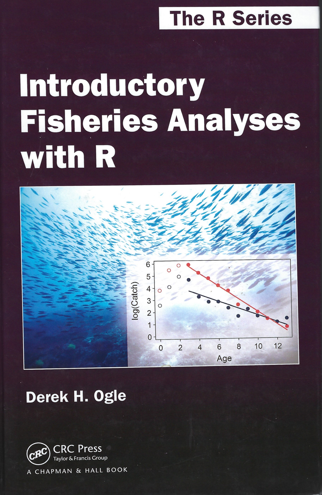

```{r setup, include=FALSE}
knitr::opts_chunk$set(echo = TRUE)
library(car)     # for scatterplotmatrix
library(GGally)  # for matrix scatterplots
library(investr)
library(lmtest)  # Needed for the Breusch Pagan heteroscedasticity test
library(Sleuth3)

```

# Homework Solutions (5:30 PM - 6:00 PM)

## Basic 6.21_3rd A Biological Basis for Homosexuality

### Alice Wynn

## Basic 7.28_3rd Brain Activity in Violin Players

### Kali Roberts

## Supplemental 6.21_2nd Failure Times in Bearings

### Keith Hankowsky

## Supplemental 7.27_2nd Big Bang II

### Shibo Cao

## Master Problem Duncan's analysis of Case 5.1 Diet Data

### Orla O'Brien

***

# Sleuth Ch 8: A closer look at assumptions for simple linear regression & Lack of Fit Tests and Ch 9 Multiple Regression

# Homework 6 Due 10/15/22

## Discussion Topics

Post one comment and a response on a Chapter 8 or Chapter 9 conceptual problem

## Computation Problems

### Basic problems

* 8.28 IQ, Education and Future Income (p 234)

* 9.21 Ingestion Rates of Deposit Feeders (p 268, One of two problems submitted by Gallagher for Sleuth3)

### Supplemental problems (both from Sleuth3)

* 8.26 Kleiber’s Law

* 9.23 Comparing Male and Female Incomes, After Accounting for Education and IQ  (p 269)

### Master Problem

* Analyze the Ruffe Weight-Length relationship from Ogle (2016, Ch 7), reproducing his Figures 7.2 & 7.3. The Ruffe data and Ogle’s code are at http://derekogle.com/IFAR/scripts/. Hints: 1) replace filterD with dplyr::filter. Reproduce the figures using code from Chapter 3.5 (pdf of the text provided) or Ogle (2016) Sections 7.1-7.3 or provide your own code. (It took Gallagher 2 h to produce his graphs before he discovered that Ogle provides the code as well as the data at the URL above.)

```{r, echo=FALSE, out.width="25%",fig.cap="Ogle (2016)"}

```

```{r, echo=FALSE, out.width="100%",fig.cap="Ogle (2016) Fig. 7.2"}

```

```{r, echo=FALSE, out.width="100%",fig.cap="Ogle (2016) Fig. 7.3"}

```

# Sat 10/15/22 3 PM Topics for Semester Research Projects Due (~1 paragraph); Projects are due Sat 12/3/2 3 pm.

## Some Old Business: 

### How do you make a Standard Curve (from Draper & Smith's Applied Regression Analysis)

* investr, a package for INVerse ESTimation in R


***

```{r investr analyses}
mod <- lm(formula=pH~log(Time),data=case0702)
# Compute approximate 95% calibration or fiducial intervals with the inversion method
inversionout<-invest(mod, y0 = 6, interval = "inversion")
inversionout
Waldout<-invest(mod, y0 = 6, interval = "Wald")
Waldout
### 3) Plot the investr inversion intervals, which are the appropriate ones
plotFit(mod, interval = "both", pch = 19, shade = TRUE, 
        col.conf = "skyblue4", col.pred = "lightskyblue2",lty.conf=2,lty.pred=4, 
        border.conf = "blue", border.pred ="blue",col.fit="red",
        main="Sleuth Case Study 7.2: investr inversion Fiducial Limits",
        xlab="Time (hours)")
lines(c(inversionout$lower,inversionout$lower),c(5,6), col="purple", lwd=2) 
lines(c(inversionout$estimate,inversionout$estimate),c(5,6), col="red", lwd=2)
lines(c(inversionout$upper,inversionout$upper),c(5,6), col="purple", lwd=2)
legend(5,7, c("Estimated Regression Line","95% Confidence Band", 
                "95% Prediction Band"),lty=c(1,2,4), 
                col=c("red","skyblue4", "lightskyblue2"),
                lwd=c(2,2,2)) 
abline(h=6, lty=3, col="red", lwd=2)
text(1.5,6.05,"Desired pH", col="red")
text(inversionout$upper+.5,6.07,"5.12 h",col="purple",cex=1.25)
text(inversionout$lower-.4,5.4,"2.95 h",col="purple",cex=1.25)
text(inversionout$estimate+.4,5.4,"3.88 h",col="red",cex=1.25)

sprintf('It is estimated that the mean pH at %4.2f h is 6.',inversionout$estimate)
sprintf('It is predicted that at least 95%% of steer carcasses will reach a pH of 6.0 sometime between %4.2f and %4.2f hours after slaughter (95%% calibration interval).',inversionout$lower, inversionout$upper)
```

***


***


***


***


***


***


***


***


***


***

## More on Regression to the Mean

“It is a universal rule that the unknown kinsman in any degree of any specified man, is probably more mediocre than he.” Galton 1886 [Before he discovered the reason for regression to the mean]

I suspect that the regression fallacy is the most common fallacy in the analysis of economic data.” Milton Friedman 1992

* Important note: regression to the mean (RTM) is a group phenomenon.

* Groups of individuals will show a consistent regression to the mean, but individuals may not. There are correction factors that take into account the RTM phenomenon.  ‘Empirical Bayes Estimators’ are now the accepted correction procedures to correct the accuracy of predictions for the RTM phenomenon.

* Ramsey & Schafer (2013, p 194-195) discuss regression to the mean

***


***


***


***


***


***


***


***


***


***


***


***


***


***


***


***

## Luck or skill in awarding MCAS winners

* What major statistical principal must be considered when analyzing test and retest data of
this sort?

* Two related statistical problems

  + Regression to the mean, which is a strong function of the correlation between tests. The weaker the correlation between tests, the more the regression to the mean phenomenon
  
  + The effects of sample size on the difference in averages.

* Note that RTM is a group phenomenon, 

>"You cannot tell which way an individual's score will move based on the regression to the mean phenomenon. Even though the group's average will move toward the population's average, some individuals in the group are likely to move in the other direction." Quote from Trochim's RTM web site

* In a test-retest situation (and many other situations of repeated measures on subjects) the change scores are
composed of a true "skill" effect, the improvement in student performance, and error.

* The error is reflected in the lack of perfect correlation between the 1st and 2nd tests.

  + In Gallagher's Matlab simulations, the correlation is 0.86 between 1998 and 1999 tests. The lack of perfect correlation could be due to differences in the teaching quality between schools, but some is due to just test-to-
test variability. 

* Consistent with the central limit theorem, the standard error for small school change scores will be greater than
for large schools

* The RTM effect is directly proportional to (1-r), with r being the test-to-test correlation.

  + With perfect correlation, there is no RTM effect.
  
* The Massachusetts Dept. of Education identified ‘winning’ schools based on their change scores on the 1998 to 1999 exams, and most of these schools had small class sizes.

  + Smaller class sizes will be associated with sample averages that deviate from the true mean to a far greater extent than large schools.
  
  + The extent of this deviation is assessed with the standard error of he difference in averages, with standard errors proportional to (1/n~1~ + 1/n~2~), where n~1~ and n~2~ are the class sizes for the two exams.
  
  + To account for class size effect on the standard error of the difference, use p values based on t tests change/(standard error of change) instead of absolute differences 
  
* Use Empirical Bayes estimators (James-Stein estimators) to adjust for the chance element in assessing change (used for batting averages & hospital mortality by Efron & Morris)

* Use hierarchical longitudinal models, assessing change in individual student performance

> ‘I had the most satisfying Eureka experience of my career while attempting to teach flight instructors that praise is more effective than punishment for promoting skill-learning. When I had finished my enthusiastic speech, one of the most seasoned instructors in the audience raised his hand and made his own short speech, which began by conceding that positive reinforcement might be good for the birds, but went on to deny that it was optimal for flight cadets. He said, “On many occasions I have praised flight cadets for clean execution of some aerobatic maneuver, and in general when they try it again, they do worse. On the other hand, I have often screamed at cadets for bad execution, and in general they do better the next time. So please don’t tell us that reinforcement works and punishment does not, because the opposite is the case.” This was a joyous moment, in which I understood an important truth about the world: because we tend to reward others when they do well and punish them when they do badly, and because there is regression to the mean, it is part of the human condition that we are statistically punished for rewarding others and rewarded for punishing them.’ Daniel Kahneman, Nobelist [Wikipedia 2/25/10]

# Chapter 8: A Closer Look at Assumptions for Simple Linear Regression

## Case 8.1 Island Area and NUmber of Species---An Observational Study


***


***


***

```{r RScs0801 r code}
library(Sleuth3)
attach(case0801)
## EXPLORATION
logSpecies <- log(Species)   
logArea  <- log(Area) 
plot(logSpecies ~ logArea, xlab="Log of Island Area",
     ylab="Log of Number of Species",
     main="Number of Reptile and Amphibian Species on 7 Islands")
myLm <- lm(logSpecies ~ logArea)    
abline(myLm)  

## INFERENCE AND INTERPRETATION
summary(myLm) 
slope     <- myLm$coef[2]   
slopeConf <- confint(myLm,2) 
100*(2^(slope)-1)   # Back-transform estimated slope
100*(2^(slopeConf)-1) # Back-transform confidence interval 
# Interpretation: Associated with each doubling of island area is a 19% increase 
# in the median number of bird species (95% CI: 16% to 21% increase).

## DISPLAY FOR PRESENTATION
plot(Species ~ Area, xlab="Island Area (Square Miles); Log Scale",  
     ylab="Number of Species; Log Scale", 
     main="Number of Reptile and Amphibian Species on 7 Islands",
     log="xy", pch=21, lwd=2, bg="green",cex=2 )    
dummyArea <- c(min(Area),max(Area)) 
beta <- myLm$coef  
meanLogSpecies <-  beta[1] + beta[2]*log(dummyArea)   
medianSpecies  <-  exp(meanLogSpecies)  
lines(medianSpecies ~ dummyArea,lwd=2,col="blue") 
island <- c(" Cuba"," Hispaniola"," Jamaica", " Puerto Rico", 
            " Montserrat"," Saba"," Redonda")  
for (i in 1:7) {   
  offset <- ifelse(Area[i] < 10000, -.2, 1.5)  
  text(Area[i],Species[i],island[i],col="dark green",adj=offset,cex=.75) }  
detach(case0801)
```

***


***


***


***
```{r Weighted regression in R }

#create residual vs. fitted plot
plot(fitted(myLm), resid(myLm), xlab='Fitted Values', ylab='Residuals')
#add a horizontal line at 0 
abline(0,0)
# There is the appearance of a trumpet shape, so perform a heteroscedasticy test
#perform Breusch-Pagan test, note Levene's only works on categorical data.
bptest(myLm)
# Weak evidence at best for heteroscedasity, but go ahead with weighted anyway
# define weights to use
wt <- 1 / lm(abs(myLm$residuals) ~ myLm$fitted.values)$fitted.values^2
#perform weighted least squares regression
wls_model <- lm(logSpecies ~ logArea, data = case0801, weights=wt)
summary(wls_model)

# The standard error has been reduced by 30%
plot(logSpecies ~ logArea, xlab="Log of Island Area",ylab="Log of Number of Species",
          main="Number of Reptile and Amphibian Species on 7 Islands")
abline(wls_model)

# Code modified from Dalgaard 2008 p 120)
pred.frame<-data.frame(log.area=logArea)
pc<-predict(wls_model,int="c",newdata=pred.frame)
# Need to apply the weights function, see:
# https://stats.stackexchange.com/questions/246095/weights-with-prediction-intervals
pp<-predict(wls_model,int="p",newdata=pred.frame, weights=wt)
plot(logArea,logSpecies, ylim=range(logSpecies,pp,na.rm=T),
                    xlab="Log of Island Area", ylab="Log of Number of Species",
                    main="Weighted Regression: Number of Reptile and Amphibian Species on 7 Islands")
pred.logarea<-pred.frame$log.area
matlines(pred.logarea,pc,lty=c(1,2,2),col="magenta")
matlines(pred.logarea,pp,lty=c(1,2,3),col="blue")

# Plot on linear scales Can't get the prediction intervals to work, due to weighting
pred.frame<-data.frame(logArea=seq(min(logArea),log(50000),0.2))
pc<-predict(wls_model,int="c",newdata=pred.frame)
pp<-predict(wls_model,int="p",newdata=pred.frame, weights=wt)
plot(case0801$Area,case0801$Species, xlim=c(-10,50000),
     ylim=range(case0801$Species,exp(pp),na.rm=T),
     xlab="Island Area", ylab="Number of Species",
main="Weighted Regression: Number of Reptile and Amphibian Species on 7 Islands")
pred.area<-exp(pred.frame$logArea)
matlines(pred.area,exp(pc),lty=c(1,2,2),col="magenta")
# matlines(pred.area,exp(pp),lty=c(1,2,3),col="blue")

ci<-confint(wls_model)
ci[2,]-wls_model$coefficients[2]

sprintf('The weighted species area relation: Species = %5.3f * Area^%5.3f +/- %5.3f ',
        exp(wls_model$coefficients[1]),wls_model$coefficients[2],
        ci[2,2]-wls_model$coefficients[2])
sprintf('The unweighted species area relation: Species = %5.3f * Area^%5.3f +/- %5.3f ',
        exp(myLm$coefficients[1]),myLm$coefficients[2],
        slopeConf[2]-myLm$coefficients[2])
```

### Statistical Summary for Case 8.1

* The parameter γ in the species-area relation, S=C A^γ^, is estimated to be 0.25, with 95% CI 0.219 to 0.281. [or with weighted regression [0.24 ± 0.02]

* It is estimated that the geometric mean number of species increases by 19% with each doubling of area (1.189≈20.25) [18% for weighted regression]

* This statistical association cannot be used to establish a causal connection (Note that major
ecological theories predict a 0.25 exponent)

***

## Case 8.2 Breakdown Times for Insulating Fluid Under Different Voltages---A Controlled Experiment


***


***


***
```{r RScs0802.r 1}
attach(case0802)

## EXPLORATION
plot(Time ~ Voltage)
myLm <- lm(Time ~ Voltage)
plot(myLm, which=1)   # Residual plot
logTime <- log(Time)
plot(logTime ~ Voltage)
myLm <- lm(logTime ~ Voltage)
abline(myLm)
plot(myLm,which=1)  # Residual plot 
myOneWay <- lm(logTime ~ factor(Voltage))   
anova(myLm, myOneWay)  # Lack of fit test for simple regression (seems okay) 

## INFERENCE AND INTERPREATION
beta <- myLm$coef
100*(1 - exp(beta[2]))   # Back-transform estimated slope 
100*(1 - exp(confint(myLm,"Voltage")))
```
### Statistical Summary for Case 8.2

* Associated with each 1 kV increase in voltage is a 40% decrease in median breakdown time (95% CI: 32% decrease to 47% decrease).

* This was a controlled laboratory experiment, so that differences in voltage are directly responsible for differences in breakdown rate

* The regression relation only applies to the range tested
```{r RScs0802.r 2}
options(scipen=50)  # Do this to avoid scientific notation on y-axis 
plot(Time ~ Voltage, log="y", xlab="Voltage (kV)",
     ylab="Breakdown Time (min.); Log Scale",
     main="Breakdown Time of Insulating Fluid as a Function of Voltage Applied",
     pch=21, lwd=2, bg="green", cex=1.75 )     
dummyVoltage <- c(min(Voltage),max(Voltage)) 
meanLogTime <- beta[1] + beta[2]*dummyVoltage  
medianTime <- exp(meanLogTime)  
lines(medianTime ~ dummyVoltage, lwd=2, col="blue")  
detach(case0802)
```

***


***


***


***


***


***


***


***


***


***

## Lack of Fit F test


***


***


***


***


***

* How to test for lack of fit in R

  + inner.mod <- lm(y ~ x, dat)
  
  + outer.mod <- lm(y ~ factor(x), dat)
  
  + anova(inner.mod, outer.mod)

***


***


***

### What to do if there is lack of fit?

* You may still estimate the slope & Y intercept using regression: OLS regression still provides unbiased estimators

* You can NOT use the variance estimates and p values based on the error mean square from the OLS linear regression

* Fit a richer or different model

  + Consider testing higher order interaction terms: quadratic & cubic, if warranted
  
  + Add other explanatory variables
  
* You may analyze the data as an ANOVA model with linear contrasts

  + Linear contrasts allows tests for linear trend, quadratic trend (hump shaped), cubic trends (S-shaped) and higher order polynomials
  
  + The variance estimate doesn’t assume equal spreads around the regression line, just equal spreads around means
  
***


***


***


***

### Statistical Conclusions about T1 from 1991 to 2001

* There is strong evidence that species richness (as measured by Fisher’s α) is increasing in Spring samples [ANOVA linear contrast (F~1,18~ = 19, p<0.001)]

* There was significant lack of fit in the OLS regression indicating perhaps non-linear patterns in year-to-year changes in species richness or cluster effects in the residuals

***


***

## Conclusions from Chapter 8

* Rule of the bulge, residual plots, and matrix scatterplots can be used to estimate appropriate transformations of data

* Lack of Fit Tests are important for judging the adequacy of regression models

  + Lack of Fit tests require true replication
  
  + In the presence of lack of fit, linear contrasts and ANOVA can be used to test for linear, quadratic, and cubic effects
  
  + If lack of fit is present, then standard error for the regression model is invalid and the p-values are incorrect.

# Chapter 9 Multiple Regression

## Major Topics in Chapter 9

* Using multiple explanatory variables

  + Multiple regression is not a multivariate procedure, since it has a single response variable and doesn’t explicitly model the covariance of the explanatory variables.
  
  + Multiple regression can produce curvilinear plots, but it is still a linear model. The response is a linear function of the parameters and is a type of general linear model
  
* Using indicator variables

  + Also called dummy or categorical variables
  
  + Q treatment levels can be coded by Q-1 indicator variables
  
  + Must pick one level of a treatment to be the reference category. Usually it is an arbitrary choice, but a control level is usually set as the reference.\
  
  + Indicator variables are usually 0 or 1, but other indicators such as +½ or -½ can be used (see my analysis of Case 10.2)
  
* Student’s t test for individual regression terms vs. Extra Sum of Squares F test

  + F test can test for the effects of the addition or deletion of one or more terms
  
  + Student’s t tests can assess the need for single terms in the regression equation
  
  + Student’s t and F tests produce identical p values for testing single terms in regression equations
  
* Tests for interactions

  + Interaction tests are always for parallel slopes or curvature in response planes & surfaces. A test for interactions tests whether the main effects are additive.
  
  + Create interaction variables by multiplying main effects variables
  
  + R's lm will create interaction variables if the interaction effect is specified

***

# Multivariate vs. Univariate

* Variables can be separated into two classes: explanatory and response (Tabachnik & Fidel and SPSS use independent and dependent), predictor vs. outcome, stimulus-response, input-output]

  + Univariate statistics: a single response
  
  + Bivariate: neither of two variables is the response (Pearson’s r, tests of independence)
  
  + Multiple (or Multivariable) regression: multiple explanatory variables but a single response
  
  + Multivariate: simultaneously analyze multiple response variables, and the explanatory variables can be single or multiple 
  
* Multivariate statistics are the complete or general case, whereas univariate and bivariate statistics are special cases of multivariate statistics

***

## R and Matlab linear model formulae

* 'Y ~ A + B + C' means a three-variable linear model with intercept

* 'Y ~ A + B + C - 1' is a three-variable linear model without an intercept

* 'Y ~ A + B + C + B^2' is a three-variable model with intercept and a B^2 term

* 'Y ~ A + B^2 + C' is the same as the previous example because B^2 includes a B term unless specifically removed

* 'Y ~ A + B + C + A:B' includes an A*B interaction term.

* 'Y ~ A*B + C' is the same as the previous example because A*B = A + B + A:B.

* 'Y ~ A*B*C - A:B:C' has all interactions among A, B, and C, except the three-way interaction. In R, is the same as Y ~ (A+B+C)^2 

* 'Y ~ A*(B + C + D)' has all linear terms, plus products of A with each of the other variables.

## Case 9.1 Effects of Light on Meadowfoam Flowering---A Randomized Experiment

## Experimental Design

* Response variable: Average number of flowers per meadowfoam plant

* Explanatory variables

  + Light intensity: 6 levels
    
      - Treated as a continuous variable
      
      - Could have been treated as 6 categories of light level
      
  + Timing of light intensity change relative to Photoperiodic Floral Induction (PFI) [day 21 or day 45]: increase of light from 8 to 16 hours
  
* Tests whether the slopes are parallel (is there an interaction effect, or are the main effects additive?)

* Could have been analyzed as a 2-factor ANOVA (Sleuth Chapter 13) or as a multiple regression analysis, but the regression approach is more powerful and general. For ANOVA, light level would be treated as a factor (a categorical variable=)

* Estimate effect sizes


***


***


***

```{r RScs0901.r}
# RScs0901_3rd
# From Sleuth3 manual
# Transcribed by Eugene.Gallagher@umb.edu 1/23/13, revised 1/24/13
library(Sleuth3)
str(case0901)
attach(case0901)
## EXPLORATION
plot(Flowers ~ Intensity, pch=ifelse(Time ==1, 19, 21))
myLm <- lm(Flowers ~ Intensity + factor(Time) + Intensity:factor(Time)) 
plot(myLm, which=1) 
summary(myLm)  # Note p-value for interaction term
# INFERENCE
myLm2 <- lm(Flowers ~ Intensity + factor(Time)) 
summary(myLm2)         
confint(myLm2)         
# DISPLAY FOR PRESENTATION
plot(Flowers ~ jitter(Intensity,.3),   
     xlab=expression("Light Intensity ("*mu*"mol/"*m^2*"/sec)"), # Include symbols
     ylab="Average Number of Flowers per Plant",
     main="Effect of Light Intensity and Timing on Meadowfoam Flowering",
     pch=ifelse(Time ==1, 21, 22), bg=ifelse(Time==1, "orange","green"),
     cex=1.7, lwd=2)          
beta <- myLm2$coef  
abline(beta[1],beta[2],lwd=2, lty=2) 
abline(beta[1]+beta[3],beta[2],lwd=2,lty=3) 
legend(700,79,c("Early Start","Late Start"),  
       pch=c(22,21),lwd=2,pt.bg=c("green","orange"),pt.cex=1.7,lty=c(3,2))
detach(case0901)
```

***


***

### Case 9.1 Statistical Summary

* Intensity: Increasing light intensity decreased the mean number of flowers per plant by 4 (± 1) plants per 100 μEm^-2^ s^-1^\

* Timing: Beginning light treatment 24 days before Photoperiodic Floral Induction (PFI) increased the mean number of flowers by 12.2 (± 5.5) (Mean ± ½ 95% CI)

* Little evidence for interaction between intensity & timing factors

## Case 9.2 Why Do Some Mammals Have Large Brains for their Size?---An Observational Study


***

### Research Questions

* Brain weight and other length measurements are scaled allometrically {Greek for different scales}

  + Y= a Weight^B^
  
  + Log-log transforms are the rule for allometric data: log(Y) = log (a) + ß×log (W)
  
* Is there an association between brain weight (response) and litter size, after controlling for the effect of body weight?

* Is there an association between brain weight (response) and gestation length, after controlling for body weight?

```{r RScs0902}
attach(case0902)
## EXPLORATION                                                                   
myMatrix      <- cbind(Brain, Body, Litter, Gestation)  
scatterplotMatrix(myMatrix,   # Matrix of scatterplots
                    smooth=FALSE,    # Omit scatterplot smoother on plots
                    diagonal="histogram") # Draw histograms on diagonals
myLm <- lm(Brain ~ Body + Litter + Gestation)
plot(myLm, which=1)  

# log transform variables
logBrain <- log(Brain)
logBody <- log(Body)
logGestation  <- log(Gestation)
myMatrix2 <- cbind(logBrain,logBody,Litter,logGestation)

scatterplotMatrix(myMatrix2, smooth=FALSE, diagonal="histogram")

# ggpairs(myMatrix2)

myLm2 <- lm(logBrain ~ logBody + Litter + logGestation)
plot(myLm2,which=1)  # Residual plot.

plot(logBrain ~ logBody)
identify(logBrain ~ logBody,labels=Species)   # Identify points on  scatterplot  
# Place the cursor over a point of interest, then left-click.
# Continue with other points if desired. When finished, pres Esc. 

## INFERENCE
summary(myLm2)           
confint(myLm2)           

# DISPLAYS FOR PRESENTATION 
myLm3 <- lm(logBrain ~ logBody + logGestation)
beta <- myLm3$coef
logBrainAdjusted  <- logBrain - beta[2]*logBody  
y <- exp(logBrainAdjusted) 
ymod <- 100*y/median(y) 
plot(ymod ~ Gestation, log="xy",  
     xlab="Average Gestation Length (Days); Log Scale",
     ylab="Brain Weight Adjusted for Body Weight, as a Percentage of the Median", 
     main="Brain Weight Adjusted for Body Weight, Versus Gestation Length, for 96 Mammal Species",
     pch=21,bg="green",cex=1.3)
identify(ymod ~ Gestation,labels=Species, cex=.7) # Identify points, as desired
# Press Esc to complete identify.
abline(h=100,lty=2) # Draw horizontal line at 100%

myLm4 <- lm(logBrain ~ logBody + Litter)
beta  <- myLm4$coef
logBrainAdjusted <- logBrain - beta[2]*logBody  
y2 <- exp(logBrainAdjusted)
y2mod <- 100*y2/median(y2)
plot(y2mod ~ Litter, log="y", xlab="Average Litter Size",
     ylab="Brain Weight Adjusted for Body Weight, as a Percentage of the Median",
     main="Brain Weight Adjusted for Body Weight, Versus Litter Size, for 96 Mammal Species",
     pch=21,bg="green",cex=1.3)
identify(y2mod ~ Litter,labels=Species, cex=.7)  
abline(h=100,lty=2)

detach(case0902)
```

### Case 9.2 Statistical Summary

* There was convincing evidence that brain weight was associated with either gestation length or litter size after accounting for the effect of body weight (p<0.0001; extra sum of squares F test).

* There was strong evidence that:

  + litter size was associated with brain weight after accounting for body weight and gestation (2-sided p value 0.0089) and,
  
  + Gestation period was associated with brain weight after accounting for body weight and litter size (2-sided p value = 0.0038)

## Case 9.1 Details

### Interactions


***


***


***


***


***


***


***

# Matrix Approach to Regression

Matrix equations can be programmed directly in Matlab or R


***


***


***


***

### Matlab's 3-line regression:

b=X\\Y; 
Yest=X*b;
resid=Y-Yest;

## Conclusions for Chapter 9

* Multiple regression is a form of general linear model

  + It is not a multivariate procedure
  
  + It can be a linear model even if the response is a curve or curved surface if the response is a linear function of the parameters

* Indicator (Categorical) variables

  + Only Q-1 indicator variables can be used for a variable with Q levels
  
  + If all Q indicators are used X’X is not full rank and can't be inverted
  
  + Usually +1, 0 indicators are used, but some models can use other coefficients
  
* Interaction terms

  + model non-parallel slopes or surfaces
  
  + are created by multiplying one main factor variable times another
  
* Extra sum of squares F test

  + Can be used to test multiple terms in a regression
  
  + Identical p value as _t_ test for a single term
  
  